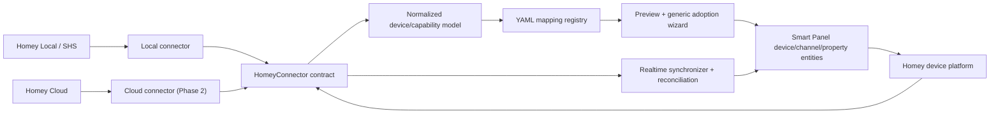

# Homey Device Integration — Design

**Status:** Approved

**Date:** 2026-08-12

**Author:** Adam Kadlec

**Related task:** `tasks/features/FEATURE-PLUGIN-HOMEY.md`

**Implementation plan:** `docs/superpowers/plans/2026-08-12-homey-integration.md`

## Goal

Add Homey as a native Smart Panel device provider. Users connect a Homey instance, inspect the logical devices that Homey already manages, adopt selected devices into Smart Panel, receive live capability updates, and control supported capabilities from the existing Smart Panel interfaces.

The first release targets Homey Self-Hosted Server (SHS) and compatible Homey Pro local APIs. A later connector adds Homey Cloud without duplicating mapping, adoption, synchronization, or control logic.

## Product Decision

Homey is a provider integration, comparable to Home Assistant, Shelly, and Zigbee2MQTT:

- Homey remains responsible for radio pairing, drivers, apps, and device ownership.
- Smart Panel discovers the logical devices exposed by Homey, not unpaired Zigbee, Z-Wave, Matter, BLE, or infrared hardware.
- Adoption creates Smart Panel devices, channels, and properties that reference Homey device and capability identifiers.
- Homey capability events update adopted Smart Panel properties in real time.
- Smart Panel control requests are translated into Homey capability writes.
- Deleting or disabling the Smart Panel integration never deletes or unpairs anything in Homey.

Local and cloud access are transport variants of one plugin, not separate provider plugins.

## Release Boundaries

### Phase 1 — Local MVP

- Homey Self-Hosted Server using its LAN address and an API key.
- Homey Pro local API where the same authentication and API behavior is verified.
- Manual address configuration is guaranteed.
- Automatic server discovery is included only if the compatibility spike confirms a stable advertised service.
- Device inventory, zones, capability metadata and current values.
- Mapping preview and batch adoption through the generic device wizard.
- Initial reconciliation, real-time updates, reconnect handling, and bounded polling fallback.
- Control of mapped writable capabilities.
- Admin configuration and health/status surfaces.
- Fixture-backed tests that remain usable after the one-month SHS subscription ends.

### Phase 2 — Homey Cloud

- Athom OAuth client registration and authorization-code flow.
- Home selection for accounts with more than one Homey.
- Cloud connector using the same normalized models and downstream services.
- Token refresh, revocation, and reconnect behavior.
- Deployment documentation for redirect URIs and Athom approval or user-limit requirements.

Cloud support must not delay the local MVP.

## Non-Goals

- Pairing, interviewing, commissioning, or removing physical devices in Homey.
- Managing Homey apps, drivers, users, flows, alarms, insights, firmware, backups, or system updates.
- Mirroring every vendor-specific capability in the first release.
- Presenting Homey-specific UI on the Flutter panel.
- Controlling Homey directly from the panel client.
- Replacing Homey's own interface.
- Using Matter Bridge as the primary integration path. It can remain a simpler future alternative with less metadata and control coverage.

## User Experience

### Configure

The admin plugin form lets an administrator choose `Local` or, after Phase 2, `Cloud`.

Local configuration contains:

- Base URL, for example `http://192.168.1.20:4859`.
- API key, accepted only on write and never returned in plaintext.
- Optional connection timeout and polling fallback interval within safe bounds.
- `Test connection` action.
- Read-only connection state, Homey identity/version where available, last successful synchronization, and last sanitized error.

An omitted API key preserves the configured secret. An explicit clear action removes it. The response exposes only `apiKeyConfigured: boolean`.

Connection tests have two mutually exclusive request modes:

- `saved`: test the fully persisted connector identity and its stored secret; endpoint/mode overrides are rejected.
- `candidate`: test an unsaved local configuration; the request must provide both the complete URL and a newly entered API key, and the backend must not resolve or reuse the stored key.

This boundary prevents an administrator-supplied URL from receiving a credential associated with the saved Homey endpoint. Canonical URL equality must not silently convert a `candidate` request into stored-secret reuse; only the explicit `saved` mode may access the stored key.

### Discover and adopt

The existing generic device wizard presents Homey devices that are available for adoption:

1. Discover: list devices with name, class, zone, availability, and capability count.
2. Confirm: select devices, edit Smart Panel names, confirm suggested categories, and inspect the proposed channel count.
3. Results: show created, updated, skipped, or failed outcomes per Homey device.

The first release uses automatic mappings and a read-only mapping preview. Fine-grained per-property customization can follow after real device fixtures show that users need it.

Already adopted devices remain visible with an `already_registered` status. Unsupported devices remain visible with a reason rather than disappearing.

### Operate

Once adopted, a Homey device behaves like any other Smart Panel device:

- Its current values are visible in admin and on the panel.
- Live changes made in Homey, by physical controls, or by Homey flows appear in Smart Panel.
- Supported commands from Smart Panel are sent to Homey.
- Offline or unavailable states are shown without deleting stored devices or last-known values.

## Architecture



### Plugin ownership

Create one plugin in each application layer:

- Backend: `apps/backend/src/plugins/devices-homey/`
- Admin: `apps/admin/src/plugins/devices-homey/`
- Panel: minimal registration/mappers under `apps/panel/lib/plugins/devices-homey/` only if plugin-specific entity types require it.

The backend plugin owns connection management, normalized Homey models, mappings, discovery, adoption, synchronization, and command transport. The panel consumes the normal Devices API and WebSocket state stream; it never receives Homey credentials.

### Connector contract

All transport-specific behavior is hidden behind a narrow interface. The exact TypeScript shape may adapt to repository conventions, but it must provide these semantics:

```typescript
interface HomeyConnector {
	connect(): Promise<void>;
	disconnect(): Promise<void>;
	getSystemInfo(): Promise<HomeySystemInfo>;
	getZones(): Promise<HomeyZone[]>;
	getDevices(): Promise<HomeyDevice[]>;
	getDevice(deviceId: string): Promise<HomeyDevice | null>;
	setCapabilityValue(deviceId: string, capabilityId: string, value: unknown): Promise<void>;
	subscribe(listener: HomeyEventListener): Promise<() => Promise<void> | void>;
}
```

Rules:

- Downstream services depend on `HomeyConnector`, never on the Homey SDK directly.
- SDK response objects and event emitters must not leak into controllers, persistence, or mapping definitions.
- Errors are normalized into authentication, authorization, timeout, unavailable, protocol, validation, and unsupported categories.
- The connector owns SDK-specific reconnect and subscription details, but plugin lifecycle remains controlled by the managed plugin service.

### Local connector

Use the official `homey-api` package if the compatibility and license spikes pass. The documented local entry point is `HomeyAPI.createLocalAPI({ address, token })`. SHS documents HTTP and Socket.IO on port `4859`, and HTTPS and Socket.IO on `4860`.

The package currently declares a Node.js version compatible with this repository, but it is Athom proprietary software licensed for use with Homey products. Before merging the dependency:

- Record the exact package version and integrity in the lockfile.
- Confirm distribution within Smart Panel is acceptable under the package license.
- Wrap it entirely inside the local connector so it can be replaced without changing the plugin domain.
- Verify timeout and cleanup behavior rather than relying on undocumented SDK defaults.

If the SDK is unsuitable, implement the same connector contract against the documented local HTTP and Socket.IO APIs. This fallback is a Phase 0 decision, not a mid-implementation rewrite.

### Cloud connector

The cloud connector uses Athom OAuth and Web API endpoints. It must be added after the local connector passes acceptance tests because it introduces external client registration, redirect URI deployment, token storage, token refresh, and possible Athom approval/user limits.

Cloud OAuth tokens use the same secret-handling rules as the local API key.

## Normalized Domain Model

The connector converts Homey data into plain internal models.

### Homey device

Required normalized fields:

- `id`: stable Homey device identifier.
- `name`.
- `class`: Homey device class.
- `zoneId` and resolved zone name/path where available.
- `available` and optional sanitized availability message.
- `driverId`, manufacturer, model, and energy metadata when present.
- `capabilities`: ordered list of normalized capabilities.

Unknown fields are ignored by default. Sanitized raw fixture payloads may be retained only in tests.

### Homey capability

Required normalized fields:

- Full `id`, including sub-capability suffixes such as `measure_temperature.inside`.
- Base ID used for descriptor matching, obtained by removing only the instance suffix.
- Display title.
- Current value.
- Type, unit, minimum, maximum, step, enum values, readable, writable, and last-updated metadata when available.
- Capability availability independent of whole-device availability when Homey exposes it.

The full capability ID is always persisted and used for reads, events, and commands. Base IDs are only mapping lookup keys.

## Persistence

Reuse the generic Devices entities wherever possible:

- Smart Panel device `identifier` = full Homey device ID.
- Channel `identifier` = stable mapping/channel key within that Homey device.
- Channel property `identifier` = full Homey capability ID.

Existing type-scoped uniqueness should make this sufficient without a database migration. Phase 0 must verify that the plugin discriminator participates in every relevant uniqueness lookup. If additional queryable Homey metadata is truly required, add an incremental migration; never modify the initial migration.

Do not persist:

- API keys or OAuth tokens in device entities.
- Raw SDK objects.
- Socket connection identifiers.
- Transient subscription state.

## Mapping System

### Mapping definitions

Store built-in mappings as YAML under the backend plugin, following the existing mapping loader/storage patterns. Allow user overrides in:

- `var/data/plugin.devices-homey.devices.yaml`
- `var/data/plugin.devices-homey.channels.yaml`
- `var/data/plugin.devices-homey.properties.yaml`

Exact filenames may be consolidated if an existing plugin pattern is a better fit. User files override built-ins deterministically and survive application upgrades.

Descriptors match primarily on Homey class and capability base IDs. Vendor/driver matching is an optional narrowing mechanism, not the default, because it would make mappings unnecessarily device-specific.

### Initial capability coverage

The MVP mapping catalog targets:

| Homey capabilities | Smart Panel behavior |
|---|---|
| `onoff` | switch/light/outlet power state and command |
| `dim` | normalized brightness |
| `light_hue`, `light_saturation` | color control |
| `light_temperature` | color-temperature control with verified range conversion |
| `measure_temperature`, `target_temperature` | temperature sensor/setpoint |
| `measure_humidity` | humidity sensor |
| `alarm_motion`, `alarm_contact` | motion/contact sensor |
| `alarm_smoke`, `alarm_co`, `measure_co2` | safety/air-quality sensor |
| `measure_power`, `meter_power` | instantaneous power and accumulated energy |
| `measure_battery`, `alarm_battery` | battery level/low-battery state |
| `locked` | lock state and command where writable |
| `windowcoverings_state`, `windowcoverings_set`, `windowcoverings_tilt_set` | cover state, position, tilt, and commands |
| thermostat mode capabilities | supported enum modes after fixture verification |
| `measure_pressure`, `measure_luminance` | pressure and illuminance sensors |

Every mapping declares:

- Eligible Homey class/capability pattern.
- Smart Panel device category, channel category, and property category.
- Read/write direction.
- Value transformation and inverse transformation when writable.
- Unit and range expectations.
- Priority and conflict behavior.

Unknown capabilities are ignored with a preview warning. They must not cause the whole device to fail adoption.

### Mapping preview

Preview is deterministic for the same normalized device and mapping versions. It returns:

- Suggested device category and alternatives.
- Proposed channels and properties.
- Homey device/capability identifiers.
- Current transformed values.
- Read/write access.
- Warnings for unsupported capabilities, conversion ambiguity, duplicate matches, and unavailable values.

Adoption revalidates against a fresh device snapshot to avoid using stale preview data.

## Discovery

There are two distinct meanings of discovery:

1. Server discovery: finding a Homey/SHS endpoint on the LAN.
2. Device discovery: listing logical devices already registered in that Homey.

Manual server URL entry is always supported. mDNS discovery is implemented only after the one-month compatibility spike identifies a stable service type and verifies behavior across SHS restarts. No guessed service record is shipped.

Device discovery is an authenticated inventory request through the active connector. It does not start radio pairing mode and must remain read-only.

## Adoption

Adoption is transactional per selected device:

1. Fetch the latest Homey device snapshot.
2. Validate the selected category and proposed mappings.
3. Find an existing Smart Panel device by plugin type plus Homey device ID.
4. Create or update the Smart Panel device.
5. Reconcile channels and properties by stable identifiers.
6. Apply initial transformed values.
7. Register the adopted identifiers with the synchronizer.
8. Return a per-device result.

A batch may partially succeed; failures are isolated per device and returned with sanitized messages. Retrying the same selection is idempotent and updates the existing adopted device rather than duplicating it.

Upstream removal behavior:

- If a Homey device disappears, mark the Smart Panel device unavailable and report the missing upstream reference.
- Never automatically delete the Smart Panel device.
- A later explicit cleanup action may let an administrator remove orphaned Smart Panel records.

## Synchronization and Reconciliation

### Initial synchronization

After connecting:

- Load system and zone metadata.
- Establish manager/device/capability subscriptions before taking the authoritative state snapshot.
- Buffer events behind a startup barrier while loading the complete Homey device inventory and reconciling adopted devices.
- Merge buffered events with the snapshot using the ordering metadata verified in Phase 0, then atomically switch to live event processing. If Homey exposes no reliable ordering metadata, use a subscription-first reconciliation barrier plus a final targeted reconciliation for capabilities touched while the snapshot was in flight.
- Mark the plugin healthy only after inventory and subscription setup succeed.

This order is mandatory: reading state before subscribing creates a gap in which a Homey change can be missed until periodic reconciliation. Startup and reconnect tests must exercise a capability change during the snapshot/subscription boundary and prove that the final Smart Panel value is the newest authoritative value.

### Real-time updates

Subscribe only as broadly as required by the SDK. Filter downstream processing to adopted device IDs and mapped full capability IDs.

For each accepted event:

- Validate device ID, capability ID, and value shape.
- Apply the mapping's read transformation.
- Update the corresponding property through the normal Devices service path.
- Coalesce bursts for the same property without reordering the final value.
- Never log raw event payloads at normal log levels.

### Reconciliation fallback

Socket.IO events are the primary state path. A bounded reconciliation loop repairs missed events and supports degraded operation:

- Full reconciliation immediately after reconnect.
- Periodic inventory reconciliation at a conservative configurable interval.
- Optional targeted read after a command when no matching event arrives within the confirmation timeout.
- Exponential reconnect backoff with jitter and a maximum delay.
- One connection/reconnect owner; no overlapping loops.

Polling must not conceal a permanently broken event subscription. Health status distinguishes `connected`, `degraded_polling`, `reconnecting`, `authentication_failed`, and `stopped`.

## Control Semantics

The Homey device platform handles writable mapped properties:

1. Validate that the property is mapped and writable.
2. Validate and normalize the Smart Panel input.
3. Apply the inverse mapping transformation.
4. Send `setCapabilityValue(deviceId, fullCapabilityId, value)` through the connector.
5. Wait for the matching Homey event as authoritative confirmation.
6. If the event does not arrive in time, perform one targeted read where supported.
7. Report timeout or rejection without presenting an unconfirmed value as final state.

Concurrent commands to the same device/capability are serialized. A later command supersedes an earlier pending confirmation for display purposes, while both transport outcomes remain observable in logs/metrics.

## API Surface

The backend remains the OpenAPI source of truth. Proposed plugin routes, under the repository's actual API prefix, are:

| Method | Path | Purpose |
|---|---|---|
| `GET` | `/plugins/devices-homey/status` | Connection and synchronization health |
| `POST` | `/plugins/devices-homey/test-connection` | Validate either the fully saved configuration or a complete candidate URL/key pair without exposing the key |
| `GET` | `/plugins/devices-homey/discovery` | Discover local Homey/SHS endpoints if supported |
| `POST` | `/plugins/devices-homey/discovery` | Restart server discovery |
| `GET` | `/plugins/devices-homey/devices` | List Homey devices with adoption status |
| `GET` | `/plugins/devices-homey/devices/:deviceId` | Read one normalized device |
| `POST` | `/plugins/devices-homey/mapping-preview` | Preview mapping for a device/category request |
| `POST` | `/plugins/devices-homey/adopt` | Adopt one device |
| `POST` | `/plugins/devices-homey/adopt/batch` | Adopt selected devices with per-device results |

Exact path naming should follow the closest current controller convention at implementation time. All actions require the standard tags, operations, response envelopes, validation, and authorization decorators.

## Security

Credential safety is a release blocker, not an optional hardening task.

- Add a generic config-secret redaction and merge mechanism if the config module still returns registered plugin DTOs verbatim.
- API keys and OAuth tokens are write-only fields.
- Omitted secret values preserve existing secrets; explicit clear is intentional and separately represented.
- Test-connection requests may reuse a stored secret only in explicit `saved` mode with no connector identity override. Candidate mode requires a complete new endpoint/secret pair and never falls back to persistence.
- Logs, exceptions, telemetry, fixtures, snapshots, and OpenAPI examples never contain real credentials.
- Use the narrowest Homey permissions that support inventory, zones, state reads, and device control.
- Connection tests use short timeouts and return categorized, sanitized errors.
- URL validation rejects unsupported schemes and credentials embedded in URLs.
- TLS verification is enabled by default. Any development-only override must be explicit, warned, and excluded from production builds/configuration.
- Configuration file permissions remain restrictive; secrets are never sent to the panel.

Recommended local scopes to verify during the spike are `homey.device.readonly`, `homey.device.control`, `homey.zone.readonly`, and `homey.system.readonly`.

## Admin Integration

Create `apps/admin/src/plugins/devices-homey/` following existing plugin conventions:

- Plugin registration and routes.
- Configuration model/store/form.
- Status and connection-test composables.
- Device inventory and mapping-preview stores.
- A `deviceWizardAdapter` factory for the shared wizard.
- Locale files for all languages required by repository tests.
- Unit tests for transformers, stores/composables, adapter reconciliation, and secret-preserving form submission.

Wizard rows include:

- Stable key: Homey device ID.
- Label: Homey device name.
- Sub-label: manufacturer/model or class.
- Identifier: Homey device ID.
- Extra cells: zone, class, capability count, and availability as useful.
- Status: checking, ready, already registered, unsupported, or failed.
- Suggested name/category and valid category options.

## Panel Integration

No Homey transport exists in Flutter. Adopted devices flow through the generic Devices API, WebSocket updates, specs, and existing device-detail widgets.

Panel work is limited to:

- Registering plugin-specific entity mappers only if the backend introduces a Homey-specific entity discriminator that generic mappers cannot instantiate.
- Regenerating the API/spec clients after backend Swagger/spec changes.
- Verifying representative lighting, sensor, thermostat, cover, lock, and energy devices render and control correctly.

## One-Month SHS Compatibility Program

The subscription is time-limited, so live verification and fixture capture happen before broad implementation.

### Days 1–3: establish the contract

- Install SHS with a stable LAN address using host networking or an equivalent dedicated address.
- Record SHS version, container image digest, exposed ports, and Smart Panel runtime topology.
- Create a narrowly scoped API key.
- Populate representative devices, using virtual devices where physical coverage is unavailable.
- Designate a disposable virtual/test device for lifecycle mutation tests. It must not represent household equipment and its synthetic alias, rather than its live identifier, is recorded in repository documents.
- Verify authentication against HTTP `4859` and HTTPS `4860` where configured.
- Capture sanitized responses for system info, zones, device inventory, individual devices, capability metadata, and current values.
- Capture sanitized Socket.IO connection and capability-event sequences.
- Verify writable capability calls on an explicitly designated harmless test device.

### Failure and lifecycle matrix

Test and record:

- SHS unavailable at startup.
- SHS restart while connected.
- API key revoked or insufficiently scoped.
- Network interruption and restoration.
- Disposable test device added, renamed, moved between zones, made unavailable, and removed.
- Capability value changed physically, through Homey, through a flow, and through Smart Panel.
- Repeated capability instances with suffixes.
- Multiple fast updates and multiple fast commands.
- Whether SHS advertises a stable mDNS record.
- Whether Homey Pro local mode is behaviorally equivalent when hardware is available.

### Fixture policy

Store fixtures under `apps/backend/src/plugins/devices-homey/__fixtures__/` or the nearest established test convention.

- Replace device IDs, names, zone names, IP addresses, driver identifiers where sensitive, and all credentials.
- Retain data shapes, types, capability suffixes, units, ranges, and enum values.
- Include expected normalized outputs beside representative raw inputs.
- Add a fixture provenance README with SHS version and capture date, but no household details.
- Validate fixtures with a secret scanner or explicit forbidden-token assertions.

The plugin must be testable after the subscription expires. Live tests remain optional and environment-gated.

## Observability

Expose and log enough information to diagnose the provider without leaking payloads:

- Connector state and transition reason.
- Last successful inventory synchronization.
- Last event timestamp.
- Reconnect attempt count and next retry delay.
- Adopted/missing/unsupported device counts.
- Event processing and command failures by normalized category.
- Reconciliation duration and changed-property count.

Routine capability updates should be trace/debug-level and rate-limited. Authentication failures should stop aggressive retrying until configuration changes.

## Testing Strategy

### Unit tests

- SDK-to-normalized-model transformation.
- Base vs. full capability ID handling.
- Mapping selection, priority, conflicts, transformations, and inverse transformations.
- Preview warnings.
- Adoption idempotency and per-device rollback behavior.
- Event filtering/coalescing and reconnect state machine.
- Command confirmation, timeout, and targeted-read fallback.
- Secret redaction and secret-preserving config merge.

### Fixture integration tests

- Inventory and zone loading from captured SHS fixtures.
- Initial reconciliation of adopted devices.
- Socket event sequences including reconnect and duplicate events.
- Representative devices for every MVP mapping family.
- Missing device and unknown capability behavior.

### Live SHS tests

- Environment-gated and excluded from default CI.
- Read-only tests run against all configured representative devices.
- Write tests require an explicit device ID/capability allowlist.
- Lifecycle mutation tests require a separate explicit environment gate plus an allowlist naming the disposable virtual/test device and permitted operations.
- Pairing, renaming, moving, making unavailable, or removing ordinary household devices is always forbidden. The lifecycle exception applies only to the designated disposable device and is cleaned up after capture.

### Admin and panel tests

- Config form never repopulates a secret.
- Wizard handles online, offline, empty, mixed-support, partial-success, and reconnect cases.
- Adopted device state updates reach the standard admin/panel stores.
- Representative panel widgets preserve their existing optimistic/confirmation semantics.

## Performance Targets

Targets for a typical local installation of up to 250 Homey devices:

- Initial device inventory and normalization completes within 10 seconds on the supported Smart Panel hardware, excluding an unavailable network timeout.
- A received capability event is handed to the Devices state path within 250 ms at p95 under normal load.
- Control transport begins within 250 ms at p95 after validation.
- The event path performs no full inventory scan per capability update.
- Reconnect backoff prevents request storms.

These are engineering targets to validate, not contractual Homey latency guarantees.

## Risks and Mitigations

| Risk | Mitigation |
|---|---|
| SHS API-key behavior differs from Homey Pro documentation | Compatibility spike before committing architecture; preserve sanitized fixtures |
| SDK license or behavior is unsuitable | License review and strict connector boundary; documented HTTP/Socket.IO fallback |
| Capability vocabulary is broad and vendor-extensible | Base-ID descriptors, full-ID persistence, warnings for unknown capabilities, iterative fixture catalog |
| Socket events are missed during reconnect | Full reconciliation after reconnect and conservative periodic reconciliation |
| API key leaks through generic config endpoints | Generic write-only secret handling is a Phase 1 release gate |
| Cloud OAuth approval delays release | Ship local MVP independently; cloud is a second connector |
| Upstream device removal causes destructive sync | Mark unavailable/orphaned; never automatically delete |
| Expiring SHS subscription removes test access | Front-load lifecycle tests and sanitized fixture capture in the first three days |

## Acceptance Summary

The local MVP is complete when an administrator can securely configure SHS, list and adopt supported Homey devices, observe initial and real-time states, control mapped writable properties, survive SHS/network restarts, understand unsupported/degraded states, and run the full automated suite without a live subscription.

## External References

- [Homey Self-Hosted Server installation and ports](https://support.homey.app/hc/en-us/articles/24010537261980-How-to-install-Homey-Self-Hosted-Server-with-Docker-on-Linux)
- [Homey local API factory](https://athombv.github.io/node-homey-api/HomeyAPI.html)
- [Homey local ManagerDevices API](https://athombv.github.io/node-homey-api/HomeyAPIV3Local.ManagerDevices.html)
- [Homey local device capability and event API](https://athombv.github.io/node-homey-api/HomeyAPIV3Local.ManagerDevices.Device.html)
- [Homey Web API](https://api.developer.homey.app/)
- [Community SHS integration field report](https://community.homey.app/t/homey-integration-for-home-assistant-now-available/148786) — useful field evidence only; not a substitute for verification against the subscribed SHS instance.
