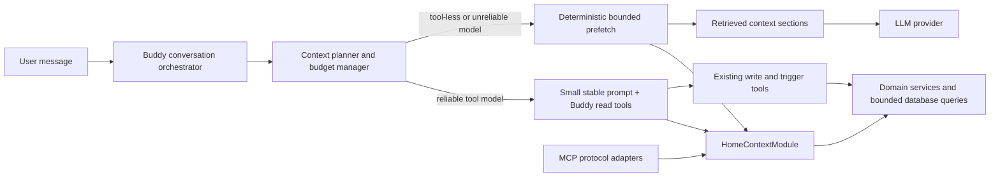
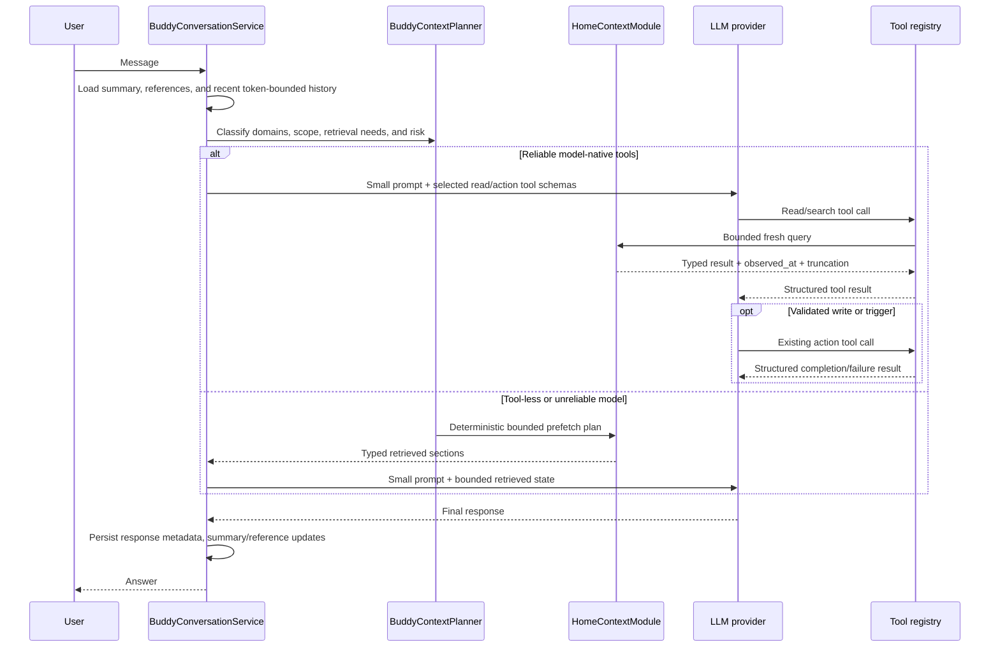

# Buddy Adaptive Context and Retrieval — Implementation Plan

**Status:** Planned

**Related work:**

- [Buddy conversation hardening](../technical/TECH-BUDDY-CONVERSATION-HARDENING.md)
- [Buddy hardening epic](../epics/EPIC-BUDDY-HARDENING.md)
- [MCP module implementation plan](./plan-mcp-module.md)
- [ADR 0001: MCP Protocol and Security Foundation](../../docs/adr/0001-mcp-protocol-and-security-foundation.md)

> **For agentic workers:** Read this plan completely before changing code. Implement the phases in order, keep the
> checkboxes current, and run the stated verification after every phase. Do not edit generated OpenAPI, admin, or
> panel clients by hand. Database changes require a new incremental migration; never modify an initial migration.

**Goal:** Make Buddy conversations reliable for small and very large installations by replacing the eager serialization
of the whole home with query-aware, bounded, fresh context. Buddy must continue to answer casual, informational,
current-state, historical, aggregate, control, scene, weather, energy, security, ambiguous, and compound messages.

**Primary decision:** Use structured retrieval and provider-neutral read tools for live Smart Panel state. Do not use
classic vector RAG as the primary home-state mechanism. Extract the reusable, bounded domain-query logic currently
behind the MCP module into a small shared `HomeContextModule`; Buddy and MCP consume that module independently. Buddy
does not require the MCP endpoint, MCP credentials, MCP clients, or MCP configuration to be enabled.

**Scope:** Backend architecture, provider contracts, Buddy conversation orchestration, bounded home queries, tool
results, conversation memory, observability, tests, performance evaluation, rollout, and documentation. Admin or panel
changes are needed only if a later implementation phase introduces user-facing configuration or status fields.

The completed `TECH-BUDDY-CONVERSATION-HARDENING` task remains a safety-net predecessor. This plan does not reopen its
race-condition or validation work; it replaces the chat-specific eager snapshot/truncation strategy with retrieval.

---

## 1. Problem Statement and Current Constraints

### 1.1 Current behavior

`BuddyConversationService` calls `BuddyContextService.buildContext()` before every LLM request. The resulting object
contains all visible spaces, devices, channels, properties, scenes, weather, energy, and recent actions. The prompt
builder serializes as much of this object as fits its system-prompt budget.

This produces several scaling and correctness problems:

- Work and prompt size grow with the entire installation instead of the entities relevant to the message.
- The current budget covers only the generated system prompt. It does not reserve space for tool schemas, history,
  the new message, tool results, provider framing, or the model's response.
- Device values can appear in both flattened state and channel/property details.
- A fixed 20-message history is not a token bound.
- Alphabetical truncation can omit the requested entity even when the installation still fits operational query limits.
- Tool definitions themselves can be material for small-context local models.
- The tool loop returns only the human-readable `ToolExecutionResult.message` to the model and drops structured
  `ToolExecutionResult.data`; read tools therefore cannot currently ground subsequent reasoning.
- Provider capability reporting is too coarse. `supportsTools()` does not describe the selected model's actual context
  window, output limit, tool reliability, or token estimation behavior.

### 1.2 Important non-conversational use of the existing context

`BuddyContextService` is not only an LLM prompt source. `HeartbeatService` and the anomaly, conflict, energy, pattern,
and scene-suggestion evaluators use its full structured snapshot for deterministic processing.

Therefore this plan does **not** remove or globally reduce that service. It separates two workloads:

| Workload | Required context | Strategy |
| --- | --- | --- |
| Proactive heartbeat/evaluators | Broad deterministic installation snapshot | Keep the existing cached `BuddyContextService` path |
| Interactive LLM conversation | Only data needed for the current turn | New adaptive retrieval and bounded query path |

After migration, `BuddyConversationService` must not call the full snapshot service. A later rename to
`BuddyEvaluationContextService` is optional and should happen only if it improves clarity without producing unnecessary
churn.

### 1.3 Success properties

The new pipeline must have these properties:

- The context for a scoped question is `O(relevant entities)`, not `O(all devices)`.
- Adding unrelated devices does not materially increase a scoped request's token count.
- Live values are read at request/tool execution time, subject only to documented domain caches.
- Tool-capable cloud models and limited local models both have a functional path.
- Ambiguous writes and triggers result in clarification rather than an arbitrary top-ranked action.
- No Buddy deployment dependency is created on the external MCP endpoint being enabled.
- Existing heartbeat and proactive evaluator behavior remains unchanged.

---

## 2. Architecture Decision

### 2.1 Selected design: adaptive structured retrieval



The same typed query services support two access styles:

1. **Model-driven retrieval:** A reliable tool-capable model starts with a small prompt and calls bounded read tools.
2. **Application-driven retrieval:** A deterministic planner classifies the message and prefetches bounded results for
   providers or selected models that cannot be trusted to call tools.

Both paths use the same filters, authorization-independent visibility rules, result schemas, freshness semantics,
limits, and truncation metadata.

### 2.2 MCP cooperation boundary

The MCP module is already integrated and contains useful read/query behavior, but its protocol services combine
transport concerns that Buddy must not inherit.

| Reuse or extract | Keep MCP-specific |
| --- | --- |
| Bounded home/space/device reads | MCP HTTP/SDK server registration |
| Weather, energy, security, and timeseries queries | MCP client authentication and tokens |
| Visibility and hidden-entity filtering | MCP policy and capability intersection |
| Result limits, freshness, and truncation rules | MCP request envelopes and installation identity |
| Writable/trigger target discovery logic | MCP audit records and deadlines |
| Typed input/output schemas | MCP resources and protocol text/structured-content wrappers |

The existing `McpContextService` should be split rather than imported wholesale:

- Move provider-neutral home data mapping and bounded reads to `HomeContextModule`.
- Move pure action-target discovery into the shared module where it can be filtered by query, space, category, and
  capability.
- Keep `McpContextService` as a compatibility facade if useful during migration.
- Keep `getInstallation()` and all MCP identity/policy/envelope behavior in `McpModule`.
- Never gate internal Buddy retrieval on `mcp.enabled`, MCP capabilities, client records, tokens, origins, or MCP server
  health.
- Validate Buddy readiness by checking the shared query/tool providers, not the MCP endpoint configuration.

Directly exporting `McpContextService` and importing `McpModule` into Buddy is allowed only as a short-lived migration
spike. It would unnecessarily pull MCP controllers, entities, auth, policy, and server lifecycle into Buddy tests and
runtime composition.

### 2.3 Why not classic vector RAG for live state

Live device state is structured, frequently changing, filterable, and actionable. Embedding every property value would
create stale results, update churn, hard-to-enforce filters, weak numeric/boolean matching, and another persistence
system. Structured queries are more accurate and auditable.

Vector or hybrid semantic retrieval is a possible later extension for relatively static unstructured content:

- Device manuals and troubleshooting documents
- Long user-authored home notes
- Free-form device or scene descriptions
- Older conversation-memory summaries when lexical/entity references are insufficient

It must not become the source of truth for current values, action target IDs, permissions, or action validation. No
embedding/vector dependency is introduced in this plan.

---

## 3. Context Layers and Turn Lifecycle

### 3.1 Context layers

Each conversational request is assembled from explicit layers with separate budgets:

1. **Stable instructions:** personality, safety rules, tool-use rules, current time/timezone, and installation identity
   needed for ordinary interaction.
2. **Conversation scope:** optional `spaceId`, recent structured entity references, and compact rolling summary.
3. **Recent turns:** token-bounded recent messages, preserving complete tool-call/tool-result groups.
4. **Current message:** never truncated below the API validation limit.
5. **Retrieved state:** only the bounded results selected by the planner or returned by tools.
6. **Tool catalog:** only tools supported by the provider/model and allowed for the current turn.
7. **Output reserve and safety margin:** held before the provider call.

### 3.2 End-to-end turn flow



### 3.3 Freshness and caching

- Search/catalog metadata may use a short event-invalidated cache.
- Current property values, security state, and action validation must be read through their current domain services at
  execution time.
- Every result includes `observed_at` and, when relevant, `total`, `returned`, and `truncated`.
- Cache invalidation covers device/channel/property changes, device and space lifecycle, scenes, weather, security,
  energy source changes, and relevant plugin registration changes.
- Retrieval failure for one optional domain produces a typed unavailable/partial result; it does not silently expand to
  the full home snapshot.
- Low-churn catalog/search metadata uses targeted invalidation and in-flight request deduplication. It must not reuse the
  current global 60-second snapshot invalidation behavior for conversational live state.
- Domain-specific freshness may differ: catalog metadata can be cached longer than property values, while weather,
  energy, and security expose their own source timestamps/availability.

---

## 4. Message Routing and Required Behavior

The planner is multi-label: one message may require several domains and both read and action stages.

| Message class | Example | Initial context/retrieval | Expected behavior |
| --- | --- | --- | --- |
| Casual or greeting | “Hi” | No home state | Answer without loading devices |
| General explanation | “How does a thermostat work?” | No home state unless explicitly connected to the installation | Give a general answer |
| Scoped current state | “What is the bedroom temperature?” | Search target, then bounded device/space state | Report fresh matching values and timestamp when useful |
| Contextual current state | “Is it too warm in here?” | Conversation space plus temperature/humidity capabilities | Use current space; ask which space if none can be inferred |
| Global aggregate | “Are any windows open?” | Structured category/value aggregate | Return count and bounded matches, not all devices |
| Target discovery | “Which lights can I dim?” | Capability-filtered search | Return bounded candidates and truncation notice |
| Exact device control | “Set kitchen light to 40%” | Target search/current constraints, then existing write tool | Validate target/value and report actual result |
| Ambiguous control | “Turn on the lamp” with several lamps | Ranked candidates only | Ask for clarification; do not choose silently |
| Scene or intent trigger | “Start movie night” | Targeted scene/trigger search | Run only an unambiguous enabled target |
| Weather | “Will it rain tomorrow?” | Bounded weather query | Use configured provider state; explain unavailability |
| Energy | “How much power did we use today?” | Bounded energy summary | Return period/unit/source with partial metadata |
| Security | “Is the house secure?” | Security status and bounded active alerts | Avoid exposing secrets; distinguish unavailable from secure |
| Historical | “Graph the living-room temperature for 24 hours” | Resolve property, then bounded timeseries | Respect period/point caps; summarize or return supported data |
| Recent-reference follow-up | “Turn it off” | Structured entity references from recent turns | Resolve only if reference is unique and action-compatible |
| Compound multi-domain | “If it is colder outside, lower the office thermostat” | Weather + device state + target constraints + action | Use iterative reads, explain condition, then act if unambiguous |
| Unsupported domain | “Book a flight” | No home query | State limitation without catalog dumping |

Rules:

- Entity resolution and domain classification are deterministic where practical; do not spend an LLM call merely to
  decide whether a greeting needs device context.
- A home-related but low-confidence message receives a small safe overview or a clarification question, never a full
  snapshot.
- `conversation.spaceId` is a default scope and ranking hint, not an authorization boundary. An explicit whole-home or
  other-space request may broaden retrieval; an unscoped phrase such as “in here” prefers the conversation space.
- Negation, units, ranges, temporal phrases, room names, and recent references must be retained in the plan.
- The planner must not execute actions. It selects reads and tool availability; existing action tools perform validated
  writes/triggers.

---

## 5. Shared Home Query Contracts

### 5.1 Proposed module boundary

```text
apps/backend/src/modules/home-context/
├── home-context.constants.ts
├── home-context.module.ts
├── models/
│   ├── home-context-query.model.ts
│   ├── home-context-result.model.ts
│   └── home-target.model.ts
├── schemas/
│   ├── home-context-input.schemas.ts
│   └── home-context-output.schemas.ts
└── services/
    ├── home-context-query.service.ts
    ├── home-state-query.service.ts
    └── home-target-query.service.ts
```

`HomeContextModule` imports only the required domain modules and exports its narrow query services. Both `BuddyModule`
and `McpModule` import it. It must not import Buddy, MCP, or `ToolsModule`.

Do not place this service in `ToolsModule`: Devices, Scenes, and Spaces already import that module, so importing those
domains back into Tools would create a circular module graph.

### 5.2 Required query operations

The internal API names can be refined during implementation, but the capabilities and bounds are required. The values
below are Buddy's conversational defaults and hard caps. Existing MCP operations select a trusted compatibility limit
profile at the adapter boundary: in particular, both whole-home and space-scoped `get_home_context` calls retain the
current 100-device cap. A shared service may accept a named internal limit profile, but a model or protocol client must
never be able to raise a limit directly.

| Operation | Required filters | Buddy default / hard bound | Result |
| --- | --- | --- | --- |
| `searchHome` | query, kinds, space, category, role, capability | 10 / 20 matches | Ranked typed entities with canonical IDs and reasons |
| `getDeviceStates` | canonical device IDs, include fields | 1 / 10 devices | Bounded channels/properties and current values |
| `getSpaceSnapshot` | one space ID, categories/capabilities | 20 / 50 devices; MCP compatibility profile: 100 devices | Compact scoped state plus truncation |
| `queryHomeState` | spaces, categories, roles, capabilities, online/value predicates | 20 / 50 matches | Safe filtered rows and/or aggregate |
| `getPropertyTimeseries` | property ID, from/to, aggregation, point limit | 100 / 500 points, max 14 days | Series, unit, source, truncation |
| `getEnergySummary` | optional space and period | max 31 days | Consumption/production/current power with units |
| `getWeather` | current and forecast days | max 5 days | Current conditions and forecast |
| `getSecurityStatus` | active state and alerts | max 20 alerts | Status, active alerts, partial/truncation |
| `searchActionTargets` | query, space, action kind, capability | 10 / 20 matches | Writable properties, scenes, or supported intents |

No operation accepts arbitrary SQL, arbitrary property paths, unbounded `include` trees, or client-selected limits above
its caller profile's hard cap. Phase 1 must preserve the other existing MCP space, scene, channel, property, security,
forecast, timeseries, and energy caps as well as its truncation semantics.

### 5.3 Database-bounded discovery

The existing MCP home-context method returns the first bounded alphabetic page, which is insufficient for finding an
entity outside that page. Add bounded filter/search methods to the owning domain services or repositories:

- Push name, space, category, role, capability, visibility, enabled, and hidden filters into database queries whenever
  represented in persistence.
- Do not call `findAll()` and filter in memory on the conversational path.
- Fetch only the fields and relations required for the requested result shape.
- Avoid N+1 channel/property loading; use existing bounded summary queries or explicit batched relation queries.
- Search across entity kinds in parallel, cap each kind, merge/rank, and cap again globally.
- A candidate scan for capability discovery must remain bounded and report truncation/cursor state.
- Aggregates such as counts, `any`, `all`, minimum, maximum, average, and sum are computed over the complete eligible
  filtered set in the database. Only returned examples are capped; never compute a “whole-home” answer from the first
  result page.
- Prefer additions to existing domain service contracts over repositories leaking into `HomeContextModule`.

### 5.4 Ranking and ambiguity

Initial deterministic ranking order:

1. Exact canonical or exposed short ID
2. Exact normalized display name
3. Exact normalized name in the current/conversation space
4. Prefix and whole-token match
5. Space match plus category/role/capability synonym match
6. Fuzzy lexical match with a conservative threshold
7. Recently referenced compatible entity

Normalization supports case folding, whitespace/punctuation normalization, and diacritics without adding a dependency
unless tests prove the platform implementation insufficient.

For reads, several close matches may be returned with scores/reasons. For writes/triggers, the resolver must mark the
result ambiguous if more than one compatible candidate is plausible. Never use a tiny score difference to authorize an
action. Canonical UUIDs remain valid tool inputs; short IDs may be registered only for entities actually exposed in the
current conversation.

### 5.5 Result contract rules

All shared results are typed and schema-validated before they reach either Buddy or MCP. Common metadata:

```typescript
interface HomeQueryMeta {
	observedAt: string;
	total?: number;
	returned: number;
	truncated: boolean;
	nextCursor?: string;
	partial?: boolean;
	unavailableDomains?: string[];
}
```

Result rules:

- Include canonical IDs, display names, space identity, type/category/role, and only capabilities necessary for the
  caller's next decision.
- Include property data type, unit, enum/range constraints, writability, and freshness when needed for an action.
- Exclude hidden/disabled entities according to existing domain behavior.
- Never include credentials, token material, secure configuration, internal stack traces, or unrelated metadata.
- Cap every string field, collection, serialized result byte size, and tool-result token contribution.
- Treat device/space/scene names and third-party values as untrusted data, not instructions.
- Preserve explicit `partial`, `unavailable`, and `truncated` states. An empty list must not falsely mean “none exist” if
  retrieval was incomplete.

---

## 6. Buddy Read Tools and Tool Loop

### 6.1 Provider-neutral Buddy read tools

Add a Buddy-owned `HomeContextToolProvider` backed by `HomeContextModule` and registered through the existing shared
tool registry. Initial definitions:

| Tool | Access/audience | Purpose |
| --- | --- | --- |
| `search_home` | `READ`, `BUDDY` | Resolve spaces, devices, properties, scenes, and capabilities |
| `get_device_state` | `READ`, `BUDDY` | Read one or a bounded set of resolved devices |
| `get_space_snapshot` | `READ`, `BUDDY` | Read relevant state in one resolved space |
| `query_home_state` | `READ`, `BUDDY` | Perform allowlisted filters and aggregates such as open windows |
| `get_property_timeseries` | `READ`, `BUDDY` | Read bounded historical property data |
| `get_energy_summary` | `READ`, `BUDDY` | Read bounded energy data |
| `get_weather` | `READ`, `BUDDY` | Read current weather/forecast |
| `get_security_status` | `READ`, `BUDDY` | Read security state and active alerts |

The implementation may combine closely related tools if provider schema overhead is demonstrably lower and clarity is
not lost. Do not advertise every tool on every turn: select the minimal relevant read/action tool set from the planner's
domain labels and provider schema budget.

MCP may keep its established protocol tool names and wrap the same shared service results in MCP envelopes. The Buddy
tool provider must not accept an MCP request/client context.

### 6.2 Structured tool-result turns

Before read tools are enabled, extend the provider-neutral conversation contract so a model can receive:

- Assistant text and zero or more tool calls with stable IDs
- One result for every tool-call ID, including status, concise message, and validated bounded structured data
- Explicit tool errors for malformed, denied, timed-out, partial, and failed calls
- Complete ordering across parallel calls and iterations

Provider adapters for OpenAI, Anthropic, and Ollama must map this canonical representation to their native
assistant-tool-call and tool-result message formats. Do not emulate tool results as ordinary user prose.

Canonical tool transcripts may remain in memory for the active turn. Existing persistence can continue to store the
original user message and final assistant response; the rolling summary, entity references, and action-result metadata
carry only the bounded information required by later turns. Persisting full tool transcripts is not required by this
plan.

`BuddyConversationService` must call the registry with an explicit execution context:

```typescript
{
	audience: ToolAudience.BUDDY,
	source: 'buddy',
	actorId,
	requestId: toolCall.id,
	allowedAccessKinds: [ToolAccessKind.READ, ToolAccessKind.WRITE, ToolAccessKind.TRIGGER],
}
```

The allowed set may be narrowed per turn. The registry, tool schema, and provider response are all validated; unknown
tools or malformed data are returned to the model as bounded errors, not thrown into an uncontrolled retry.

### 6.3 Loop limits and safety

- Keep a configurable total iteration limit and add per-turn read/action call limits.
- Permit parallel independent reads where the provider supports them, but serialize dependent actions.
- Budget every tool result before the next model call; compact or truncate only at schema-defined boundaries.
- If retrieval truncates, let the model refine its query rather than requesting the entire catalog.
- A timeout or optional-domain error can produce a partial answer; action validation failure cannot be converted into
  success.
- Prevent repeated identical tool calls with the same arguments within one turn unless an action or freshness event
  justifies a reread.
- Preserve idempotency/request IDs through existing command and intent paths.

---

## 7. Deterministic Planner and Fallback Path

### 7.1 Planner output

`BuddyContextPlannerService` receives the current message, conversation space, recent entity references, and provider
capabilities. It returns a testable plan, for example:

```typescript
interface BuddyContextPlan {
	domains: Array<'home' | 'weather' | 'energy' | 'security' | 'history' | 'general'>;
	intent: 'none' | 'read' | 'write' | 'trigger' | 'mixed';
	scope: { spaceId?: string; referencedEntityIds?: string[] };
	queries: HomeContextQuery[];
	toolNames: string[];
	ambiguityRisk: 'none' | 'read' | 'action';
	strategy: 'no-home-context' | 'model-tools' | 'prefetch' | 'clarify';
}
```

The initial planner should use deterministic lexical/domain signals, known entity references, API-provided space scope,
and provider capability metadata. It must be cheap, local, and predictable. An LLM planner can be evaluated later but
must not be required for the initial scalable path.

### 7.2 Tool-less/unreliable model behavior

For a provider/model without reliable tools:

- Execute only the plan's bounded read queries before the provider call.
- Render typed results as compact structured sections with clear data delimiters.
- Offer no action tool to a text-only provider. If current product behavior parses text into actions elsewhere, that
  path remains outside this plan and must preserve existing validation.
- For an ambiguous action, ask a deterministic clarification question with bounded candidates.
- For a compound query that exceeds the safe prefetch capability, answer the supported portion and ask a focused
  follow-up rather than injecting the full home.

Fallback must remain bounded if classification, query execution, or provider capability detection fails. The legacy full
device snapshot is not an error fallback.

---

## 8. Complete Request Budgeting

### 8.1 Provider/model capability contract

Extend `ILlmProvider` with selected-model capabilities rather than relying only on `supportsTools()`:

```typescript
interface LlmModelCapabilities {
	contextWindowTokens: number;
	maxOutputTokens: number;
	toolCalling: 'reliable' | 'limited' | 'unsupported';
	parallelToolCalls: boolean;
	supportsStructuredToolResults: boolean;
}
```

The provider returns capabilities for the configured model. Buddy configuration remains an explicit override/fallback
for unknown or local models. Ollama capability detection must not claim reliable tool use solely because the provider
API can accept a tool field.

Providers may expose an exact tokenizer/estimator. Buddy keeps a conservative common estimator when none exists and
adds configurable safety margin for framing differences.

### 8.2 Budget equation

Before every provider call, including each tool iteration:

```text
available input = context window
                - requested output reserve
                - provider framing reserve
                - safety margin

serialized input = stable system instructions
                 + tool schemas
                 + rolling summary and references
                 + recent complete message/tool groups
                 + current user message
                 + prefetched or returned tool data
```

The provider call is rejected or compacted before dispatch when `serialized input > available input`. A final payload
check belongs as close as possible to provider serialization so adapter-specific overhead is not ignored.

### 8.3 Compaction order

When over budget, compact in this order:

1. Drop irrelevant optional tools.
2. Reduce retrieved result limits while preserving the requested/selected entity.
3. Replace old recent messages with the persisted rolling summary.
4. Remove low-priority old reference entries.
5. Shorten nonessential result labels/descriptions at schema boundaries.
6. Ask a focused clarification if the request still cannot be grounded safely.

Never silently drop the current message, action constraints, tool call/result pairing, ambiguity warnings, or the only
matching target. Never retry with the full snapshot.

---

## 9. Conversation Memory and References

### 9.1 Memory model

Replace the fixed-count history strategy with:

- A token-bounded window of recent complete conversational turns
- A compact rolling summary for older turns
- Structured recent entity references containing canonical ID, kind, display label, space, compatible action types,
  and last-mentioned time

References enable “it”, “that room”, or “the second light” without reloading unrelated state. References are hints, not
authorization; live target compatibility and action constraints are checked again.

### 9.2 Persistence

Preferred initial persistence is additive fields on `BuddyConversationEntity`, such as summary text, summary-through
message ID/timestamp, and bounded JSON reference metadata. The exact normalized shape should be selected after checking
SQLite query and update patterns.

Requirements:

- Add a new incremental TypeORM migration.
- Update summary/reference state transactionally after a successful turn or through an idempotent queued update.
- Never summarize the same message range twice after retry.
- Cap summary and reference JSON sizes.
- If LLM summarization is unavailable, use deterministic truncation/extractive fallback.
- Summary failure must not fail the user's completed conversational turn.
- Recent history selection must begin on a user turn and preserve user/final-assistant pairing. If full tool transcripts
  are ever persisted later, tool-call/result groups must also remain indivisible.
- Do not expose internal memory fields through public response models unless a separate product requirement is approved.

---

## 10. Security, Privacy, and Action Correctness

- Continue to execute device writes through `PropertyCommandService` and scenes/intents through their existing validated
  runtime services.
- Re-resolve canonical IDs and current constraints at execution time; never act only on text returned by search.
- Use shared visibility rules so hidden/disabled entities cannot be discovered through Buddy.
- Treat all catalog labels, descriptions, third-party values, and historical strings as untrusted data. Tool-result
  serialization must clearly delimit data and prohibit interpreting it as system/tool instructions.
- Limit and escape strings before prompt inclusion. Reject invalid UTF-8/control patterns according to existing JSON
  serialization behavior.
- Never expose configuration secrets, credentials, authorization data, secure storage, raw provider errors, or stack
  traces.
- Log IDs/counts/statuses where useful, but do not log raw sensitive property values or full prompts by default.
- Reads may return several candidates. Writes and triggers require one unambiguous compatible target.
- For safety-relevant/security devices, preserve existing authorization/command restrictions and add focused regression
  tests; retrieval does not broaden tool permissions.
- A model saying an action succeeded is not evidence. The final response must be grounded in the structured tool result.

---

## 11. Observability and Operational Signals

Record bounded metadata for each turn and provider iteration:

- Context strategy: no-home-context, model-tools, prefetch, or clarification
- Planner domains/intent and selected tool names
- Estimated total input, output reserve, actual provider input/output tokens, and estimation error when actuals exist
- Counts of history turns, summary bytes/tokens, references, retrieved entities, and truncated results
- Query/tool durations, statuses, retry/duplicate suppression, and iteration count
- Whether a fallback, partial result, ambiguity guard, or budget compaction occurred
- Provider/model capability decision

Prefer adding optional fields to existing assistant-message metadata where the stored JSON contract supports it. Use the
existing stats/logging patterns for aggregate operational counters. Avoid a schema migration solely for verbose tracing.

Recommended counters/histograms:

- `buddy_context_strategy_total{strategy}`
- `buddy_context_estimated_input_tokens`
- `buddy_context_retrieved_entities`
- `buddy_context_truncations_total{reason}`
- `buddy_tool_calls_total{name,status}`
- `buddy_tool_iterations`
- `buddy_context_query_duration_ms{operation}`
- `buddy_ambiguous_action_total`

Any labels must be low-cardinality; do not use entity, conversation, user, or free-form query values as metric labels.

---

## 12. Proposed File Map

The final implementation should follow existing naming and may adjust individual filenames, but the ownership boundaries
must remain:

```text
apps/backend/src/modules/home-context/
├── home-context.constants.ts
├── home-context.module.ts
├── models/
├── schemas/
└── services/
    ├── home-context-query.service.ts
    ├── home-state-query.service.ts
    └── home-target-query.service.ts

apps/backend/src/modules/buddy/
├── entities/
│   └── buddy-conversation.entity.ts
├── platforms/
│   └── llm-provider.platform.ts
├── services/
│   ├── buddy-context-planner.service.ts
│   ├── buddy-context-renderer.service.ts
│   ├── buddy-conversation-memory.service.ts
│   ├── buddy-conversation.service.ts
│   ├── buddy-request-budget.service.ts
│   ├── buddy-context.service.ts             # retained for evaluators
│   └── home-context-tool-provider.service.ts
└── buddy.module.ts

apps/backend/src/modules/mcp/
├── services/
│   └── mcp-context.service.ts               # protocol-facing facade/installation identity
├── tools/
│   ├── mcp-read-tool.service.ts             # MCP auth/audit/envelope adapter
│   └── mcp-target-discovery-tool.service.ts # MCP auth/audit/envelope adapter
└── mcp.module.ts

apps/backend/src/modules/devices/services/   # bounded filtered domain queries as needed
apps/backend/src/modules/scenes/services/    # bounded filtered scene search as needed
apps/backend/src/modules/spaces/services/    # bounded filtered space search as needed
apps/backend/src/migrations/
└── <next-timestamp>-AddBuddyConversationMemory.ts
```

Generated OpenAPI/admin/panel clients are unchanged unless a later, separately approved public API change requires
regeneration from backend Swagger sources.

---

## 13. Implementation Phases

### Phase 0 — Baseline, fixtures, and measurable budgets

**Files:**

- `apps/backend/src/modules/buddy/services/buddy-conversation.service.spec.ts`
- `apps/backend/src/modules/buddy/services/buddy-context.service.spec.ts`
- New Buddy context evaluation fixtures/helpers under the Buddy test tree

**Tasks:**

- [ ] Add fixtures for 10, 100, and 1,000-device installations with realistic channels/properties.
- [ ] Add an opt-in 5,000-device soak fixture outside normal unit CI for query/result/memory bounds.
- [ ] Record current prompt/request size, domain-query counts, latency, and failure behavior for the message matrix.
- [ ] Add a serialization-level test helper that measures the complete provider input, not only the system prompt.
- [ ] Add characterization tests proving heartbeat/evaluators consume the broad `BuddyContextService` snapshot.
- [ ] Define test thresholds and a checked-in evaluation matrix; do not rely on anecdotal manual prompts.
- [ ] Confirm existing MCP context outputs/limits in tests before extracting them.

**Gate:** Baseline numbers and characterization tests exist, including at least one test that fails under eager full-home
conversation context for a small-window model.

### Phase 1 — Extract the provider-neutral home query layer

**Files:**

- New `apps/backend/src/modules/home-context/**`
- `apps/backend/src/modules/mcp/services/mcp-context.service.ts`
- `apps/backend/src/modules/mcp/tools/mcp-target-discovery-tool.service.ts`
- `apps/backend/src/modules/mcp/mcp.module.ts`
- Owning domain services/specs under Devices, Spaces, and Scenes

**Tasks:**

- [ ] Create `HomeContextModule` with typed inputs, outputs, shared limits, and schema validation.
- [ ] Move bounded home/device/weather/energy/security/timeseries mapping from MCP into shared services without changing
      MCP external output behavior.
- [ ] Convert MCP/Nest transport exceptions at the adapter boundary; shared query services return typed domain results
      and errors rather than MCP/HTTP-specific failures.
- [ ] Keep MCP installation identity, auth, policy, auditing, request envelope, and transport deadlines in MCP.
- [ ] Extract pure writable/trigger discovery logic from the MCP tool adapter.
- [ ] Add database-bounded lexical/entity search and safe filtered/aggregate state queries.
- [ ] Preserve `observed_at`, `total`, `returned`, `partial`, and `truncated` metadata.
- [ ] Import `HomeContextModule` from MCP and prove the MCP endpoint can be disabled while shared queries still work.
- [ ] Avoid a Buddy-to-`McpModule` dependency and avoid a domain-to-`ToolsModule` cycle.
- [ ] Add targeted catalog cache invalidation and in-flight query deduplication without changing evaluator snapshot cache
      semantics.

**Tests:** Shared service unit tests; domain query integration tests; MCP facade/tool regression tests; hidden/disabled entity
tests; query limit and truncation tests; N+1/query-count assertions for large fixtures.

**Gate:** MCP behavior is backward compatible, and a targeted entity beyond the first 100 alphabetic devices is found by
bounded search without loading the full catalog.

### Phase 2 — Canonical structured tool turns

**Files:**

- `apps/backend/src/modules/buddy/platforms/llm-provider.platform.ts`
- `apps/backend/src/modules/buddy/services/buddy-conversation.service.ts`
- Buddy LLM provider plugins/adapters and their specs
- Shared tools registry specs as needed

**Tasks:**

- [ ] Represent assistant tool calls and tool results as canonical conversation items with stable call IDs.
- [ ] Carry validated `ToolExecutionResult.data` to the next model iteration.
- [ ] Map canonical items to native OpenAI, Anthropic, and Ollama formats.
- [ ] Preserve ordering and one result/error per call, including malformed provider responses.
- [ ] Pass explicit Buddy audience/source/access context to the registry.
- [ ] Add per-result byte/token caps, structured truncation metadata, duplicate-call suppression, and timeout handling.
- [ ] Ensure provider logs and persisted messages do not leak full raw tool data.

**Tests:** Provider adapter contract tests, parallel call ordering, malformed arguments, unknown tools, denied access, partial
results, timeouts, oversized results, repeated calls, and max-iteration behavior.

**Gate:** A model can search, receive structured IDs/state, perform a second dependent read or validated action, and
produce a final grounded response.

### Phase 3 — Add Buddy read tools

**Files:**

- `apps/backend/src/modules/buddy/services/home-context-tool-provider.service.ts`
- `apps/backend/src/modules/buddy/buddy.module.ts`
- New tool-provider specs

**Tasks:**

- [ ] Implement the bounded Buddy read tool catalog from Section 6.
- [ ] Mark tools `ToolAudience.BUDDY` and `ToolAccessKind.READ`.
- [ ] Validate inputs and outputs using the shared schemas.
- [ ] Return concise messages plus bounded structured data and freshness/truncation metadata.
- [ ] Register only exposed results in `ShortIdMappingService`; retain canonical UUID fallback.
- [ ] Add tool selection support so unrelated schemas are not advertised on every turn.
- [ ] Verify no MCP configuration, token, policy, or server service is injected.

**Tests:** Every schema boundary and hard cap, missing optional modules, stale/missing entities, hidden/disabled entities,
long labels/values, and multi-language/diacritic search.

**Gate:** Buddy can answer every read-only home-state row in the message matrix using tools without the eager context.

### Phase 4 — Deterministic planner and bounded prefetch

**Files:**

- `apps/backend/src/modules/buddy/services/buddy-context-planner.service.ts`
- `apps/backend/src/modules/buddy/services/buddy-context-renderer.service.ts`
- Planner/renderer specs

**Tasks:**

- [ ] Implement multi-label message classification, scope/reference extraction, risk, and provider strategy selection.
- [ ] Implement deterministic prefetch through the same shared query contracts.
- [ ] Render compact typed sections with untrusted-data delimiters and explicit partial/truncated states.
- [ ] Add ambiguity detection and deterministic clarification candidates for risky actions.
- [ ] Add safe unknown/low-confidence behavior that never falls back to the full snapshot.
- [ ] Select only domain-relevant read and action tool schemas.

**Tests:** Every message class, compound queries, negation, units, temporal ranges, missing/current space, ambiguous names,
recent references, unsupported requests, and tool-less/limited provider strategies.

**Gate:** A tool-less small-context model receives bounded relevant context for all supported read classes, and greetings
load no home state.

### Phase 5 — Complete request budget manager and provider capabilities

**Files:**

- `apps/backend/src/modules/buddy/platforms/llm-provider.platform.ts`
- `apps/backend/src/modules/buddy/services/buddy-request-budget.service.ts`
- `apps/backend/src/modules/buddy/services/llm-provider.service.ts`
- Provider plugins/adapters and config model only where required

**Tasks:**

- [ ] Add selected-model context/output/tool capability reporting with conservative fallback.
- [ ] Budget system instructions, schemas, summary, references, complete recent turns, current message, retrieved data,
      provider framing, output, and safety reserve.
- [ ] Recompute the budget before every tool-loop provider call.
- [ ] Add token-aware compaction in the required order and preserve complete tool groups.
- [ ] Add provider-adapter final serialized-payload checks.
- [ ] Calibrate estimator safety margins against actual token usage from OpenAI/Anthropic and representative Ollama
      models.
- [ ] Keep the existing configured context window as override/fallback for providers that cannot report a model limit.

**Tests:** 2k/4k/8k/128k/200k windows, large tool schemas, oversized property strings, many tool iterations, estimator error,
unknown Ollama model, and output reserve enforcement.

**Gate:** No test provider receives an over-window serialized request, and the requested entity/action constraints survive
compaction.

### Phase 6 — Conversation summary and structured reference memory

**Files:**

- `apps/backend/src/modules/buddy/entities/buddy-conversation.entity.ts`
- `apps/backend/src/modules/buddy/services/buddy-conversation-memory.service.ts`
- `apps/backend/src/modules/buddy/services/buddy-conversation.service.ts`
- New incremental migration and specs

**Tasks:**

- [ ] Persist bounded rolling summary progress and structured entity references.
- [ ] Load recent messages by token budget instead of fixed count.
- [ ] Preserve complete user/final-assistant pairs during window selection; preserve canonical tool groups if they are
      persisted in a future extension.
- [ ] Update summaries incrementally and idempotently with a deterministic failure fallback.
- [ ] Resolve follow-up pronouns only when kind/action compatibility and recency make the reference unambiguous.
- [ ] Expire and cap references; handle deleted or moved entities gracefully.
- [ ] Keep memory fields private to the backend unless separately approved.

**Tests:** 100+ message conversations, concurrent messages, restart persistence, summary-provider failure, duplicate retry,
deleted entities, reference ambiguity, and migration upgrade from an existing installation.

**Gate:** Long conversations remain inside budget and correct recent references work after restart without loading full
message history.

### Phase 7 — Switch the conversational path

**Files:**

- `apps/backend/src/modules/buddy/services/buddy-conversation.service.ts`
- `apps/backend/src/modules/buddy/buddy.module.ts`
- `apps/backend/src/modules/buddy/services/buddy-context.service.ts` documentation/comments as needed

**Tasks:**

- [ ] Remove `BuddyContextService.buildContext()` from the interactive conversation path.
- [ ] Integrate planner, budget manager, memory, selected tools, prefetch, and structured tool loop.
- [ ] Keep `BuddyContextService` and its cache listener for heartbeat/evaluators.
- [ ] Add a bounded internal rollout switch if needed; both new strategies must remain bounded.
- [ ] If a temporary `legacy`/snapshot rollout mode is retained for comparison, make it explicit (never an automatic
      error fallback) and enforce the complete-request budget before dispatch.
- [ ] Ensure provider/tool/query failures produce a useful partial response or focused clarification.
- [ ] Update Buddy module metadata/readme claims so they describe adaptive retrieval rather than a full snapshot.

**Tests:** Conversation controller/service regression, concurrent messages, title update behavior, LLM timeouts, existing
write/trigger tools, messaging adapters, and heartbeat/evaluator regression.

**Gate:** No conversational code path loads or serializes every device/property, while proactive suggestions still pass
their full existing test suite.

### Phase 8 — Observability, security review, and scale evaluation

**Files:**

- Buddy message metadata/stat providers/logging
- Home-context and Buddy integration/evaluation specs
- Developer documentation

**Tasks:**

- [ ] Add the low-cardinality counters and per-turn metadata from Section 11.
- [ ] Add safe debug traces for strategy, counts, budgets, and truncation without raw sensitive values.
- [ ] Run the 10/100/1,000-device scale suite and record results in this plan or an attached report.
- [ ] Run prompt-injection tests using malicious entity names, property strings, scene labels, and historical values.
- [ ] Run ambiguity/wrong-target action tests with duplicate names across spaces.
- [ ] Run provider/model matrix tests for OpenAI, Anthropic, and representative tool-capable and tool-less Ollama models.
- [ ] Verify MCP enabled/disabled states do not affect Buddy retrieval.
- [ ] Verify optional weather/energy/security modules and plugin failures produce honest partial results.

**Gate:** All acceptance criteria and rollout thresholds in Sections 14 and 15 pass.

### Phase 9 — Rollout and legacy removal

**Tasks:**

- [ ] Enable shadow planner/query metrics first if a production-like environment is available; do not execute shadow
      writes/triggers.
- [ ] Roll out adaptive prefetch for read-only turns, then read tools, then compound read/action turns.
- [ ] Monitor budget error, query latency, tool-loop completion, clarification, partial-result, and wrong-target rates.
- [ ] Remove the legacy conversational full-context prompt builder after the observation gate.
- [ ] Keep adaptive retrieval as the default for at least one observed release cycle before deleting temporary rollout
      code, unless the project is still pre-release and equivalent production-like evidence is documented.
- [ ] Retain the evaluator snapshot service and document its distinct purpose.
- [ ] Update task status/checklists and architecture documentation.

**Gate:** The legacy full-home conversational path is removed, no rollback condition is active, and evaluator behavior is
unchanged.

---

## 14. Verification Matrix

### 14.1 Scale and performance

- [ ] For the same scoped query, complete serialized input at 1,000 devices is no more than 1.25× the 10-device input
      when the additional devices are unrelated.
- [ ] Greetings and general questions execute zero home catalog/state queries.
- [ ] Targeted reads return at most the documented entity/property caps.
- [ ] Conversational retrieval never calls `DevicesService.findAll()` or an equivalent unbounded catalog method.
- [ ] Search can find a relevant entity beyond the first alphabetic page.
- [ ] Query counts are bounded and do not grow linearly through N+1 relation loading.
- [ ] Every provider dispatch fits the selected model's context limit including output reserve.

### 14.2 Functional message coverage

- [ ] Casual/general messages
- [ ] Current state by device, property, capability, and space
- [ ] Global filtered aggregate
- [ ] Exact and ambiguous control
- [ ] Scene and intent trigger
- [ ] Weather, energy, security, and historical data
- [ ] Recent-reference follow-up
- [ ] Compound multi-domain read/action
- [ ] Unsupported request and optional-domain unavailability

### 14.3 Robustness and security

- [ ] Duplicate names, renamed/deleted entities, offline devices, null/invalid values
- [ ] Extremely long labels and values, Unicode, diacritics, and control characters
- [ ] Malicious instructions embedded in entity names/values
- [ ] Malformed tool arguments/results, provider tool errors, timeout, and partial data
- [ ] 100+ message history, summary failure, concurrent sends, and restart
- [ ] No secret/config/token leakage in prompts, tool results, metadata, metrics, or logs
- [ ] No action on an ambiguous target; no false claim of action success
- [ ] MCP endpoint disabled, MCP capabilities empty, or no MCP client records
- [ ] Heartbeat and all deterministic evaluators remain functionally unchanged

### 14.4 Physical action testing

Use simulator devices/scenes for automated action tests. Real-device smoke tests, if performed, must use explicitly
designated safe targets and reversible values. Scale/shadow evaluation must never execute writes or triggers.

---

## 15. Acceptance Criteria and Rollout Thresholds

### Required acceptance criteria

- [ ] Buddy conversations no longer eagerly build or serialize the full installation context.
- [ ] Buddy supports every message class in Section 4 through model tools, bounded prefetch, or explicit clarification.
- [ ] Context size for scoped queries remains effectively constant as unrelated devices are added.
- [ ] Tool-capable providers receive native structured read results, including data and call IDs.
- [ ] Tool-less/limited providers receive deterministic bounded prefetched context.
- [ ] Complete provider requests are budgeted, including schemas, history, tool results, and output reserve.
- [ ] Long conversations use token-aware history plus persisted bounded summary/reference memory.
- [ ] Ambiguous actions never silently select a candidate.
- [ ] Shared home-query services are usable by Buddy with MCP externally disabled.
- [ ] MCP transport/auth/policy/configuration remains independent and externally backward compatible.
- [ ] Existing heartbeat/evaluator full-context behavior remains unchanged.
- [ ] All new query, planning, budgeting, tool-loop, memory, security, and scale tests pass.

### Initial rollout thresholds

These values should be refined from Phase 0 baseline data, but changes must be recorded explicitly:

| Signal | Initial threshold |
| --- | --- |
| Scoped input growth from 10 to 1,000 devices | `<= 1.25x` |
| Over-context provider dispatches in tests | `0` |
| Wrong-target actions in ambiguity suite | `0` |
| Unbounded conversational catalog reads | `0` |
| Structured tool calls missing a result | `0` |
| Retrieval result exceeding a hard schema limit | `0` |
| Heartbeat/evaluator regression failures | `0` |
| Secret leakage fixtures appearing in output/logs | `0` |

Rollback conditions include any wrong-target action, repeated provider over-context errors, material regression in
supported message recall, or proactive evaluator regression. Rollback selects the previous **bounded** strategy; it must
not restore the full-home prompt as a generic failure fallback.

---

## 16. Explicit Non-Goals

- Requiring users to enable or configure the MCP endpoint for Buddy
- Reusing MCP client tokens, policies, transport sessions, protocol envelopes, or audit identity for internal Buddy calls
- Embedding live device values or building a vector database for current home state
- Exposing arbitrary SQL, arbitrary OpenAPI operations, or unrestricted device metadata to the LLM
- Replacing deterministic heartbeat/evaluator snapshots with LLM retrieval
- Letting the planner directly execute actions
- Changing public Buddy REST/WebSocket response shapes without a separate approved requirement
- Editing generated OpenAPI, admin, or panel clients manually
- Adding a new dependency where existing NestJS, TypeORM, Zod, and lexical matching are sufficient

---

## 17. Follow-up Opportunities After This Plan

Only evaluate these after structured retrieval meets the rollout thresholds:

- Hybrid/vector retrieval for manuals, user-authored notes, or other unstructured static knowledge
- Learned semantic ranking layered after exact/lexical/capability filtering
- Cursor-based conversational browsing of very large result sets
- Provider-specific exact tokenizers where cost and maintenance justify them
- User-visible privacy/context diagnostics showing why Buddy accessed particular domains
- Offline deterministic answers for a small set of state/aggregate questions without invoking an LLM
- A shared agent-context SDK if more internal agent surfaces adopt `HomeContextModule`

---

## 18. Risks and Resolved Questions

| Risk/question | Decision or mitigation |
| --- | --- |
| Should Buddy require MCP to be enabled and configured? | No. Buddy and MCP share internal query services; MCP external configuration is unrelated. |
| Should Buddy import all of `McpModule`? | No for the final design. Extract `HomeContextModule`; direct MCP import is only a disposable migration spike. |
| Should the existing Buddy context service be replaced? | Not for evaluators. Remove only its conversation consumer and retain full deterministic snapshots. |
| Could first-page limits hide a target in a large home? | Yes; add filtered database-bounded search before limiting, plus explicit truncation/cursor metadata. |
| Could bounded examples produce an incorrect aggregate? | Yes; compute aggregates over the complete eligible filtered set and cap only examples. |
| Could provider tool support vary by model? | Yes; capability reporting is per selected model with conservative fallback. |
| Could tool schemas consume too much local-model context? | Yes; planner advertises a minimal domain-relevant subset and budgets serialized schemas. |
| Could device names inject instructions? | Yes; treat all home data as untrusted, delimit/cap it, and validate every action outside the model. |
| Could retrieval become stale? | Read live state through domain services and expose timestamps; cache only appropriate metadata with targeted invalidation. |
| Could a planner miss an unusual home question? | Reliable tool models retain bounded discovery; fallback models receive safe bounded prefetch or clarification, never a catalog dump. |
| Should full tool transcripts be persisted? | Not initially. Persist final turns, bounded summary/references, and action metadata; keep active tool transcript in memory. |
| Is vector RAG required? | No for live state. Revisit only for static, unstructured knowledge after structured retrieval succeeds. |

Implementation choices that remain intentionally local to a phase and must be documented in its code/tests:

- Exact conservative fuzzy-match threshold and ambiguity margin
- Exact per-tool byte/token caps below the global hard limits
- Whether summary/reference persistence uses additive conversation columns or a separate normalized table
- Whether optional domain adapters report `unavailable` or `partial` for each failure mode
- Whether provider token estimation stays character-based or uses an adapter-specific tokenizer

These choices do not change the architecture. Select the simplest existing-pattern-compatible implementation and record
the chosen bounds in constants and tests.

---

## 19. Verification Commands

Run focused tests after each phase, then the backend suite. Exact Jest paths may be grouped as implementation files are
added.

```bash
pnpm --filter ./apps/backend run test:unit -- --runInBand \
  src/modules/buddy/services/buddy-conversation.service.spec.ts \
  src/modules/buddy/services/buddy-context.service.spec.ts \
  src/modules/mcp/services/mcp-context.service.spec.ts \
  src/modules/mcp/tools/mcp-read-tool.service.spec.ts \
  src/modules/mcp/tools/mcp-target-discovery-tool.service.spec.ts \
  src/modules/tools/services/tool-provider-registry.service.spec.ts

pnpm run test:unit
pnpm run test:e2e
pnpm run lint:js
```

When a migration is added, verify upgrade against a copy of a pre-change SQLite database in addition to a clean test
database. When Swagger decorators/public models change, run `pnpm run generate:openapi` rather than editing generated
clients. No OpenAPI generation is expected for the internal-only design described here.
