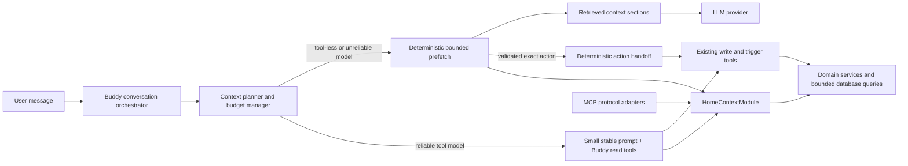
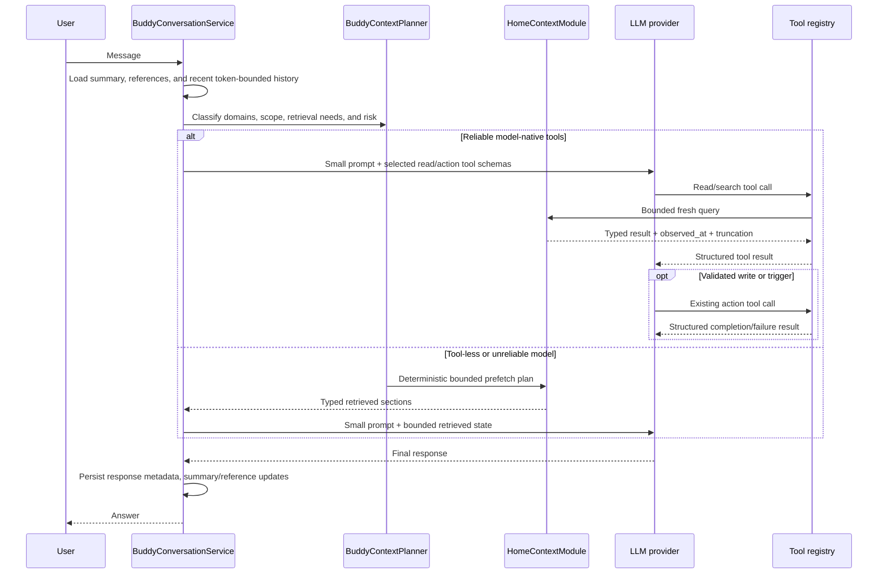

# Buddy Adaptive Context and Retrieval — Implementation Plan

**Status:** Planned

**Related work:**

- [Buddy conversation hardening](../technical/TECH-BUDDY-CONVERSATION-HARDENING.md)
- [Buddy hardening epic](../epics/EPIC-BUDDY-HARDENING.md)
- [MCP module implementation plan](./plan-mcp-module.md)
- [ADR 0001: MCP Protocol and Security Foundation](../../docs/adr/0001-mcp-protocol-and-security-foundation.md)

> **For agentic workers:** Read this plan completely before changing code. Implement the phases in order, keep the
> checkboxes current, and run the stated verification after every phase. Do not edit generated OpenAPI, admin, or
> panel clients by hand. Database changes require a new incremental migration; never modify an initial migration.

**Goal:** Make Buddy conversations reliable for small and very large installations by replacing the eager serialization
of the whole home with query-aware, bounded, fresh context. Buddy must continue to answer casual, informational,
current-state, historical, aggregate, control, scene, weather, energy, security, ambiguous, and compound messages.

**Primary decision:** Use structured retrieval and provider-neutral read tools for live Smart Panel state. Do not use
classic vector RAG as the primary home-state mechanism. Extract the reusable, bounded domain-query logic currently
behind the MCP module into a small shared `HomeContextModule`; Buddy and MCP consume that module independently. Buddy
does not require the MCP endpoint, MCP credentials, MCP clients, or MCP configuration to be enabled.

**Scope:** Backend architecture, provider contracts, Buddy conversation orchestration, bounded home queries, tool
results, conversation memory, observability, tests, performance evaluation, rollout, and documentation. Admin or panel
changes are needed only if a later implementation phase introduces user-facing configuration or status fields.

The completed `TECH-BUDDY-CONVERSATION-HARDENING` task remains a safety-net predecessor. This plan does not reopen its
race-condition or validation work; it replaces the chat-specific eager snapshot/truncation strategy with retrieval.

---

## 1. Problem Statement and Current Constraints

### 1.1 Current behavior

`BuddyConversationService` calls `BuddyContextService.buildContext()` before every LLM request. The resulting object
contains all visible spaces, devices, channels, properties, scenes, weather, energy, and recent actions. The prompt
builder serializes as much of this object as fits its system-prompt budget.

This produces several scaling and correctness problems:

- Work and prompt size grow with the entire installation instead of the entities relevant to the message.
- The current budget covers only the generated system prompt. It does not reserve space for tool schemas, history,
  the new message, tool results, provider framing, or the model's response.
- Device values can appear in both flattened state and channel/property details.
- A fixed 20-message history is not a token bound.
- Alphabetical truncation can omit the requested entity even when the installation still fits operational query limits.
- Tool definitions themselves can be material for small-context local models.
- The tool loop returns only the human-readable `ToolExecutionResult.message` to the model and drops structured
  `ToolExecutionResult.data`; read tools therefore cannot currently ground subsequent reasoning.
- Provider capability reporting is too coarse. `supportsTools()` does not describe the selected model's actual context
  window, output limit, tool reliability, or token estimation behavior.

### 1.2 Important non-conversational use of the existing context

`BuddyContextService` is not only an LLM prompt source. `HeartbeatService` and the anomaly, conflict, energy, pattern,
and scene-suggestion evaluators use its full structured snapshot for deterministic processing.

Therefore this plan does **not** remove or globally reduce that service. It separates two workloads:

| Workload | Required context | Strategy |
| --- | --- | --- |
| Proactive heartbeat/evaluators | Broad deterministic installation snapshot | Keep the existing cached `BuddyContextService` path |
| Interactive LLM conversation | Only data needed for the current turn | New adaptive retrieval and bounded query path |

After migration, `BuddyConversationService` must not call the full snapshot service. A later rename to
`BuddyEvaluationContextService` is optional and should happen only if it improves clarity without producing unnecessary
churn.

### 1.3 Success properties

The new pipeline must have these properties:

- The context for a scoped question is `O(relevant entities)`, not `O(all devices)`.
- Adding unrelated devices does not materially increase a scoped request's token count.
- Live values are read at request/tool execution time, subject only to documented domain caches.
- Tool-capable cloud models and limited local models both have a functional path.
- Ambiguous writes and triggers result in clarification rather than an arbitrary top-ranked action.
- No Buddy deployment dependency is created on the external MCP endpoint being enabled.
- Existing heartbeat and proactive evaluator behavior remains unchanged.

---

## 2. Architecture Decision

### 2.1 Selected design: adaptive structured retrieval



The same typed query services support two access styles:

1. **Model-driven retrieval:** A reliable tool-capable model starts with a small prompt and calls bounded read tools.
2. **Application-driven retrieval:** A deterministic planner classifies the message and prefetches bounded results for
   providers or selected models that cannot be trusted to call tools. A separate deterministic handoff can turn only a
   high-confidence, fully resolved user command into the same validated action-provider call.

Both paths use the same filters, authorization-independent visibility rules, result schemas, freshness semantics,
limits, and truncation metadata.

### 2.2 MCP cooperation boundary

The MCP module is already integrated and contains useful read/query behavior, but its protocol services combine
transport concerns that Buddy must not inherit.

| Reuse or extract | Keep MCP-specific |
| --- | --- |
| Bounded home/space/device reads | MCP HTTP/SDK server registration |
| Weather, energy, security, and timeseries queries | MCP client authentication and tokens |
| Visibility and hidden-entity filtering | MCP policy and capability intersection |
| Result limits, freshness, and truncation rules | MCP request envelopes and installation identity |
| Writable/trigger target discovery logic | MCP audit records and deadlines |
| Typed input/output schemas | MCP resources and protocol text/structured-content wrappers |

The existing `McpContextService` should be split rather than imported wholesale:

- Move provider-neutral home data mapping and bounded reads to `HomeContextModule`.
- Move pure action-target discovery into the shared module where it can be filtered by query, space, category, and
  capability.
- Keep `McpContextService` as a compatibility facade if useful during migration.
- Keep `getInstallation()` and all MCP identity/policy/envelope behavior in `McpModule`.
- Never gate internal Buddy retrieval on `mcp.enabled`, MCP capabilities, client records, tokens, origins, or MCP server
  health.
- Validate Buddy readiness by checking the shared query/tool providers, not the MCP endpoint configuration.

Directly exporting `McpContextService` and importing `McpModule` into Buddy is allowed only as a short-lived migration
spike. It would unnecessarily pull MCP controllers, entities, auth, policy, and server lifecycle into Buddy tests and
runtime composition.

### 2.3 Why not classic vector RAG for live state

Live device state is structured, frequently changing, filterable, and actionable. Embedding every property value would
create stale results, update churn, hard-to-enforce filters, weak numeric/boolean matching, and another persistence
system. Structured queries are more accurate and auditable.

Vector or hybrid semantic retrieval is a possible later extension for relatively static unstructured content:

- Device manuals and troubleshooting documents
- Long user-authored home notes
- Free-form device or scene descriptions
- Older conversation-memory summaries when lexical/entity references are insufficient

It must not become the source of truth for current values, action target IDs, permissions, or action validation. No
embedding/vector dependency is introduced in this plan.

---

## 3. Context Layers and Turn Lifecycle

### 3.1 Context layers

Each conversational request is assembled from explicit layers with separate budgets:

1. **Stable instructions:** personality, safety rules, tool-use rules, current time/timezone, and installation identity
   needed for ordinary interaction.
2. **Conversation scope:** optional `spaceId`, recent structured entity references, and compact rolling summary.
3. **Recent turns:** token-bounded recent messages, preserving complete tool-call/tool-result groups.
4. **Current message:** never truncated below the API validation limit.
5. **Retrieved state:** only the bounded results selected by the planner or returned by tools.
6. **Tool catalog:** only tools supported by the provider/model and allowed for the current turn.
7. **Output reserve and safety margin:** held before the provider call.

### 3.2 End-to-end turn flow



### 3.3 Freshness and caching

- Search/catalog metadata may use a short event-invalidated cache.
- Current property values, security state, and action validation must be read through their current domain services at
  execution time.
- Every result includes `observed_at` and, when relevant, `total`, `returned`, and `truncated`.
- Cache invalidation covers device/channel/property changes, device and space lifecycle, scenes, weather, security,
  energy source changes, and relevant plugin registration changes.
- Retrieval failure for one optional domain produces a typed unavailable/partial result; it does not silently expand to
  the full home snapshot.
- Low-churn catalog/search metadata uses targeted invalidation and in-flight request deduplication. It must not reuse the
  current global 60-second snapshot invalidation behavior for conversational live state.
- Domain-specific freshness may differ: catalog metadata can be cached longer than property values, while weather,
  energy, and security expose their own source timestamps/availability.

---

## 4. Message Routing and Required Behavior

The planner is multi-label: one message may require several domains and both read and action stages.

| Message class | Example | Initial context/retrieval | Expected behavior |
| --- | --- | --- | --- |
| Casual or greeting | “Hi” | No home state | Answer without loading devices |
| General explanation | “How does a thermostat work?” | No home state unless explicitly connected to the installation | Give a general answer |
| Scoped current state | “What is the bedroom temperature?” | Search target, then bounded device/space state | Report fresh matching values and timestamp when useful |
| Contextual current state | “Is it too warm in here?” | Conversation space plus temperature/humidity capabilities | Use current space; ask which space if none can be inferred |
| Global aggregate | “Are any windows open?” | Structured category/value aggregate through live-value authority | Return count/bounded matches, or explicit partial coverage when values are unknown |
| Target discovery | “Which lights can I dim?” | Capability-filtered search | Return bounded candidates and truncation notice |
| Exact device control | “Set kitchen light to 40%” | Target search/current constraints, then existing write tool or deterministic handoff | Validate target/value and report actual result |
| Ambiguous control | “Turn on the lamp” with several lamps | Ranked candidates only | Ask for clarification; do not choose silently |
| Scene or intent trigger | “Start movie night” | Targeted search, then model tool or deterministic handoff | Run only an unambiguous enabled target |
| Weather | “Will it rain tomorrow?” | Bounded weather query | Use configured provider state; explain unavailability |
| Energy | “How much power did we use today?” | Bounded energy summary | Return period/unit/source with partial metadata |
| Security | “Is the house secure?” | Security status and bounded active alerts | Avoid exposing secrets; distinguish unavailable from secure |
| Historical | “Graph the living-room temperature for 24 hours” | Resolve property, then bounded timeseries | Respect period/point caps; summarize or return supported data |
| Recent-reference follow-up | “Turn it off” | Structured entity references from recent turns | Resolve only if reference is unique and action-compatible |
| Compound multi-domain | “If it is colder outside, lower the office thermostat” | Weather + device state + target constraints + action | Use iterative reads, explain condition, then act if unambiguous |
| Unsupported domain | “Book a flight” | No home query | State limitation without catalog dumping |

Rules:

- Entity resolution and domain classification are deterministic where practical; do not spend an LLM call merely to
  decide whether a greeting needs device context.
- A home-related but low-confidence message receives a small safe overview or a clarification question, never a full
  snapshot.
- `conversation.spaceId` is a default scope and ranking hint, not an authorization boundary. An explicit whole-home or
  other-space request may broaden retrieval; an unscoped phrase such as “in here” prefers the conversation space.
- Negation, units, ranges, temporal phrases, room names, and recent references must be retained in the plan.
- The planner must not execute actions. It selects reads, tool availability, or the deterministic-handoff strategy;
  existing action providers still perform every validated write/trigger.

---

## 5. Shared Home Query Contracts

### 5.1 Proposed module boundary

```text
apps/backend/src/modules/home-context/
├── home-context.constants.ts
├── home-context.module.ts
├── models/
│   ├── home-context-query.model.ts
│   ├── home-context-result.model.ts
│   └── home-target.model.ts
├── schemas/
│   ├── home-context-input.schemas.ts
│   └── home-context-output.schemas.ts
└── services/
    ├── home-context-query.service.ts
    ├── home-state-query.service.ts
    └── home-target-query.service.ts
```

`HomeContextModule` imports only the required domain modules and exports its narrow query services. Both `BuddyModule`
and `McpModule` import it. It must not import Buddy, MCP, or `ToolsModule`.

Do not place this service in `ToolsModule`: Devices, Scenes, and Spaces already import that module, so importing those
domains back into Tools would create a circular module graph.

### 5.2 Required query operations

The internal API names can be refined during implementation, but the capabilities and bounds are required. The values
below are Buddy's conversational defaults and hard caps. Existing MCP operations select a trusted compatibility limit
profile at the adapter boundary: in particular, both whole-home and space-scoped `get_home_context` calls retain the
current 100-device cap. A shared service may accept a named internal limit profile, but a model or protocol client must
never be able to raise a limit directly.

| Operation | Required filters | Caller-profile default / hard bound | Result |
| --- | --- | --- | --- |
| `searchHome` | query, kinds, space, category, role, capability | 10 / 20 matches | Ranked typed entities with canonical IDs and reasons |
| `getHomeSnapshot` | optional space ID, trusted adapter profile | Not a Buddy tool; MCP profile preserves spaces 50, devices 100, scenes 50, and existing domain caps | Composite spaces/devices/scenes/weather/energy/security snapshot with per-section truncation/partial metadata |
| `getDeviceStates` | canonical device IDs, include fields | 1 / 10 devices | Bounded channels/properties and current values |
| `getSpaceSnapshot` | one space ID, categories/capabilities | 20 / 50 devices; MCP compatibility profile: 100 devices | Compact scoped state plus truncation |
| `queryHomeState` | spaces, categories, roles, capabilities, online/value predicates | 20 / 50 matches | Safe filtered rows and/or aggregate |
| `getPropertyTimeseries` | property ID, from/to, aggregation, point limit | 100 / 500 points, max 14 days | Series, unit, source, truncation |
| `getEnergySummary` | optional space and period | max 31 days | Consumption/production/current power with units |
| `getWeather` | optional location ID, forecast days | max 5 days | Requested location, or primary location when omitted, plus current conditions and forecast |
| `getSecurityStatus` | active state and alerts | max 20 alerts | Status, active alerts, partial/truncation |
| `searchActionTargets` | query, space, action kind, capability | 10 / 20 matches | Writable properties, scenes, or supported intents |

No operation accepts arbitrary SQL, arbitrary property paths, unbounded `include` trees, or client-selected limits above
its caller profile's hard cap. Phase 1 must preserve the other existing MCP space, scene, channel, property, security,
forecast, timeseries, and energy caps as well as its truncation semantics.

`getHomeSnapshot` is a provider-neutral compatibility contract for `McpContextService.getHomeContext()`. An omitted space
reproduces the existing composite whole-home result; a supplied space reproduces its scoped form, including ordering,
visibility/disabled semantics, weather selection, totals, and section-specific caps/truncation. The Buddy conversational
planner/tool provider must not expose this composite MCP profile or use it as an eager fallback; Buddy uses the focused
operations above with its stricter profiles.

### 5.3 Database-bounded discovery

The existing MCP home-context method returns the first bounded alphabetic page, which is insufficient for finding an
entity outside that page. Add bounded filter/search methods to the owning domain services or repositories:

- Push name, space, category, role, capability, visibility, enabled, and hidden filters into database queries whenever
  represented in persistence.
- Do not call `findAll()` and filter in memory on the conversational path.
- Fetch only the fields and relations required for the requested result shape.
- Avoid N+1 channel/property loading; use existing bounded summary queries or explicit batched relation queries.
- Search across entity kinds in parallel, cap each kind, merge/rank, and cap again globally.
- A candidate scan for capability discovery must remain bounded and report truncation/cursor state.
- Metadata-only aggregates such as entity counts may execute over the complete eligible filtered set in the database.
  Current property values are not a normal persisted TypeORM column: use database filters only to identify eligible
  property IDs, then call a new batch/aggregate API on the owning `PropertyValueService`. That API reconciles its newer
  in-memory values with available storage values, processes eligible IDs in bounded chunks under a deadline/work ceiling,
  and tracks missing/unknown values. It may short-circuit only when logically sound (`any=true` after one match or
  `all=false` after one counterexample); a negative/complete result requires complete coverage.
- Return `partial: true` plus eligible/evaluated/unknown counts and source/freshness metadata whenever storage is
  disconnected, values are missing, or the scan/deadline cannot establish completeness. Never report a definitive
  `none`, `all`, minimum, maximum, average, or sum from a first page or incomplete value set. Only returned examples are
  capped; server-side aggregate work remains independently bounded.
- Prefer additions to existing domain service contracts over repositories leaking into `HomeContextModule`.

### 5.4 Ranking and ambiguity

Initial deterministic ranking order:

1. Exact canonical or short ID explicitly present in the original user input and valid in this conversation
2. Exact normalized display name
3. Exact normalized name in the current/conversation space
4. Prefix and whole-token match
5. Space match plus category/role/capability synonym match
6. Fuzzy lexical match with a conservative threshold
7. Recently referenced compatible entity

Normalization supports case folding, whitespace/punctuation normalization, and diacritics without adding a dependency
unless tests prove the platform implementation insufficient.

For reads, several close matches may be returned with scores/reasons. For writes/triggers, the resolver must mark the
result ambiguous if more than one compatible candidate is plausible. Never use a tiny score difference to authorize an
action. Canonical UUIDs remain valid tool inputs, but for a Buddy-origin action the UUID/short ID supplied by the model is
not resolution proof. Search/read exposure never grants action authority. `BuddyActionResolutionService` must bind a
server-generated `BuddyActionResolutionProof` to the request claim, original-user-intent digest, action kind/arguments,
canonical target, candidate-set digest, conversation/safety epoch, resolution method, and expiry. Valid methods are an
identifier explicitly supplied by the user, a deterministic unique match/reference with a completeness-safe collision
check, or a structured user selection bound to an expiring clarification candidate set. The proof is server-held and not
a model-selectable tool argument.

Immediately before planning and dispatch, re-resolve current target existence/capability and validate the proof. If the
original request was ambiguous, search was truncated/incomplete, a new plausible collision appears, or the model selects
one ID from several returned candidates, no proof exists and the action fails closed with a structured ambiguity result.
Persist the proof with the canonical action plan before dispatch. Non-Buddy MCP/tool consumers retain their existing ID
semantics and authorization paths.

Buddy short-ID mappings are namespaced by conversation: register only entities actually exposed in that conversation,
and resolve a Buddy short ID only inside the same conversation scope.
Never fall back from a failed scoped Buddy lookup to the application-wide mapping. Preserve the existing unscoped
mapping behavior for non-Buddy consumers that require compatibility. If two UUIDs collide inside one conversation,
generate a distinct salted token before exposure; expire or evict the scoped mapping with the conversation/reference
retention policy.

### 5.5 Result contract rules

All shared results are typed and schema-validated before they reach either Buddy or MCP. Common metadata:

```typescript
interface HomeQueryMeta {
	observedAt: string;
	total?: number;
	returned: number;
	evaluated?: number;
	unknown?: number;
	truncated: boolean;
	nextCursor?: string;
	partial?: boolean;
	unavailableDomains?: string[];
}
```

Result rules:

- Include canonical IDs, display names, space identity, type/category/role, and only capabilities necessary for the
  caller's next decision.
- Include property data type, unit, enum/range constraints, writability, and freshness when needed for an action.
- Apply a trusted visibility profile per adapter/operation. Hidden entities remain excluded. MCP compatibility reads
  preserve the current behavior of returning disabled devices/scenes with `enabled: false`; Buddy read results may
  expose that status when needed to answer the user, while action-target discovery excludes disabled or otherwise
  non-actionable targets.
- Never include credentials, token material, secure configuration, internal stack traces, or unrelated metadata.
- Apply prompt/tool token-oriented string, serialized-byte, and token-contribution caps at the Buddy adapter/renderer
  boundary. The shared query layer may expose named trusted serialization profiles; the MCP compatibility profile keeps
  existing textual values unchanged and preserves its current collection/point limits and truncation metadata. Do not
  silently apply new Buddy string caps to MCP property values, weather fields, alert messages, or other protocol output.
- Treat device/space/scene names and third-party values as untrusted data, not instructions.
- Preserve explicit `partial`, `unavailable`, and `truncated` states. An empty list must not falsely mean “none exist” if
  retrieval was incomplete.

---

## 6. Buddy Read Tools and Tool Loop

### 6.1 Provider-neutral Buddy read tools

Add a Buddy-owned `HomeContextToolProvider` backed by `HomeContextModule` and registered through the existing shared
tool registry. Initial definitions:

| Tool | Access/audience | Purpose |
| --- | --- | --- |
| `search_home` | `READ`, `BUDDY` | Resolve spaces, devices, properties, scenes, and capabilities |
| `get_device_state` | `READ`, `BUDDY` | Read one or a bounded set of resolved devices |
| `get_space_snapshot` | `READ`, `BUDDY` | Read relevant state in one resolved space |
| `query_home_state` | `READ`, `BUDDY` | Perform allowlisted filters and aggregates such as open windows |
| `get_property_timeseries` | `READ`, `BUDDY` | Read bounded historical property data |
| `get_energy_summary` | `READ`, `BUDDY` | Read bounded energy data |
| `get_weather` | `READ`, `BUDDY` | Read current weather/forecast |
| `get_security_status` | `READ`, `BUDDY` | Read security state and active alerts |

The implementation may combine closely related tools if provider schema overhead is demonstrably lower and clarity is
not lost. Do not advertise every tool on every turn: select the minimal relevant read/action tool set from the planner's
domain labels and provider schema budget.

MCP may keep its established protocol tool names and wrap the same shared service results in MCP envelopes. The Buddy
tool provider must not accept an MCP request/client context.

### 6.2 Structured tool-result turns

Before read tools are enabled, extend the provider-neutral conversation contract so a model can receive:

- Assistant text and zero or more tool calls with stable IDs
- One result for every tool-call ID, including status, concise message, and validated bounded structured data
- Explicit tool outcomes for malformed, denied, timed-out, partial, failed, and action-`indeterminate` calls
- Complete ordering across parallel calls and iterations

Provider adapters for OpenAI Chat, Anthropic, Ollama, and OpenAI Codex Responses must map this canonical representation
to their native assistant-tool-call and tool-result formats. The Codex adapter emits `function_call` and
`function_call_output` input items correlated by the native `call_id`; it must not serialize a dependent tool result as
an ordinary user/assistant `message`. Do not emulate tool results as ordinary user prose in any adapter.

Canonical tool transcripts may remain in memory for the active turn. Existing persistence can continue to store the
original user message and final assistant response; the rolling summary, entity references, and action-result metadata
carry only the bounded information required by later turns. Persisting full tool transcripts is not required by this
plan.

Every external entry point must pass a request context through the conversation-service boundary:

```typescript
interface BuddyRequestContext {
	conversationId: string;
	source: 'rest' | 'voice' | 'discord' | 'telegram' | 'whatsapp' | 'internal';
	idempotencyScopeId: string;
	actorId?: string;
	requestId: string;
	idempotencyDigest: string;
	authorization: {
		decision: 'authenticated-user' | 'mapped-user' | 'allowlisted-platform' | 'unmapped-platform' | 'internal';
		allowedAccessKinds: Array<'read' | 'write' | 'trigger'>;
	};
}
```

`BuddyConversationService.sendMessage()` accepts this context together with the conversation ID and content. REST and
voice controllers derive a stable actor ID and explicit access decision from the authenticated request. Messaging
adapters pass their mapped Smart Panel user ID when available; an explicit platform allowlist/role may also grant action
access. Otherwise they use a stable source-qualified opaque actor ID with `unmapped-platform` and `READ` only. An
adapter's “empty allowlist = admit all” behavior permits conversation access only and never grants `WRITE` or `TRIGGER`.
Raw platform identifiers must not be logged. Actor attribution is not authorization: Buddy selects schemas and the
registry allows access solely from the validated `authorization.allowedAccessKinds`, never from `actorId` presence.
Missing/unmapped authorization fails to `READ` only. Trusted internal/system turns use an explicit internal actor and
policy decision rather than silently receiving elevated access.

The stored authorization is the first-delivery attribution and maximum grant, not a timeless capability. When a queued
or recovered claim acquires its turn lease, resolve the current user mapping/allowlist/role/policy and intersect its
access kinds with the stored snapshot; require the current mapped principal to match the originally bound actor for any
write/trigger. Repeat that fresh check immediately before every `ACTION_DISPATCHING` transition. Revocation or remapping
removes action schemas when known before the model call and must still fail closed in the registry/provider if it changes
during the loop. A later regrant never widens an old claim beyond its snapshot. Already-dispatched actions follow normal
indeterminate/reconciliation handling; authorization changes cannot retroactively prove cancellation.

Each entry point preserves a validated client/event-stable inbound request ID. Both REST text and audio endpoints require
a documented `Idempotency-Key` header; every first-party REST client generates one key per logical send and reuses it for
every network retry. Validate a conservative length/character format before the handler and expose the header in Swagger.
The text controller hashes the canonical request payload. The audio controller computes a cryptographic digest from the
uploaded bytes plus stable semantic fields before transcription and passes it through
`BuddyRequestContext.idempotencyDigest`; never recompute audio idempotency from transcription text, which may vary across
attempts or collide for different recordings. Immediately after hashing, the audio controller acquires the durable claim
and transitions its owner to `PREPROCESSING` before calling any STT provider. Same-process duplicates join it;
cross-worker duplicates wait only within the deadline or receive the typed in-progress response, and neither invokes STT.
Persist the first successful bounded transcript and transition to `INPUT_READY` before model dispatch so recovery reuses
it. An expired preprocessing lease may retry side-effect-free STT only when no transcript was committed. Messaging
adapters use their stable source-qualified platform event/message ID plus a payload digest, and trusted internal callers
supply a stable job/event ID and digest. A server-generated per-attempt ID is allowed only for explicitly read-only
internal work and cannot authorize an action-capable turn.

REST uses the stable route conversation ID as `idempotencyScopeId`. Messaging adapters derive a source-qualified opaque
scope from the platform chat/channel/thread identity and persist an atomic mapping from that scope to the Buddy
conversation ID; never rely on their current in-memory maps for replay correctness. Raw platform identifiers are neither
logged nor stored when a stable keyed digest/opaque form is sufficient. Trusted internal jobs supply a stable scope.

Conversation deletion must not cascade away messaging bindings or request claims. In the delete transaction, lock each
affected binding, clear its active conversation, increment its generation, and retain a tombstone containing only the
opaque scope and prior generation metadata; claims retain the bound conversation UUID as a non-cascading scalar. A later
new platform event atomically creates/rebinds a conversation at the next generation. Before resolving that active
binding, however, the adapter checks the immutable delivery claim: an old redelivery returns its retained terminal,
in-progress, or indeterminate outcome and never creates a conversation or calls a model. For a fresh claim, the context
conversation must match the current active binding/generation.

Deletion also fences workers through claim compare-and-swap. Claims with no possible dispatch may be cancelled without
execution; `ACTION_DISPATCHING`/`ACTION_DISPATCHED` claims follow the authoritative-reconciliation-or-`INDETERMINATE`
rule and remain retained. Terminal claims and binding tombstones live for at least the configured maximum supported
platform-redelivery/idempotency window. After that window, adapters reject verifiably stale deliveries rather than
treating them as fresh. This makes retention bounded without turning cleanup or conversation deletion into a replay path.

The conversation boundary uniquely claims every external delivery before any provider call. REST/voice claims use
`(source, actorClaimKey, idempotencyScopeId, requestId)`, so two authenticated actors may legitimately reuse a client
key. Messaging claims use immutable platform delivery identity `(source, idempotencyScopeId, requestId)` independent of
the account's mutable Smart Panel user mapping. The resolved actor/authorization snapshot, Buddy conversation ID, and
payload digest are bound data, not messaging uniqueness inputs. A redelivery after account remapping therefore resolves
the original claim/outcome and cannot run under either the old or new actor; only a genuinely new platform event uses the
new mapping. The service returns a stable
`requestClaimId`. The claim is a durable state machine with an owner/lease and bounded stored outcome metadata, for
example `RECEIVED`, `QUEUED`, `PREPROCESSING`, `INPUT_READY`, `MODEL_IN_FLIGHT`, `ACTION_PLANNED`, `ACTION_DISPATCHING`,
`ACTION_DISPATCHED`, `COMPLETED`, `FAILED`, `CANCELLED`, `REJECTED_CAPACITY`, or `INDETERMINATE`.
An exact duplicate with the same digest joins the existing in-process single-flight. A duplicate owned by another
worker/process waits only within the request deadline, then returns a typed in-progress response with `Retry-After`; it
must not invoke the model concurrently. The same key with a different text/audio digest returns a typed conflict and
executes nothing.

Store this state machine in a new `BuddyRequestClaimEntity` created by an incremental migration. Its database-enforced
unique key uses source, a normalized non-null `claimPrincipalKey`, stable idempotency scope, and request ID. Trusted
entry-point code derives `claimPrincipalKey` from the stable authenticated actor for REST/voice/internal traffic and a
fixed delivery sentinel for messaging, making messaging uniqueness actor-independent. Bound columns include the
first-delivery actor/authorization snapshot, resolved Buddy conversation ID and binding generation, payload digest,
module safety epoch, conversation turn sequence, state, lease owner/expiry, optimistic version, bounded canonical
plan/outcome references, and timestamps.
`BuddyRequestIdempotencyService` owns transactional create-or-read and compare-and-swap transitions; an in-memory map may
only optimize joining requests already owned by this process and is never the authority for uniqueness, leases, or
restart recovery.

Persist the canonical user message with its claim (or idempotently before `MODEL_IN_FLIGHT`) and key stored turn rows by
`requestClaimId + role + ordinal`. Persist the final assistant message, bounded terminal outcome, and claim transition to
`COMPLETED` in one database transaction. Recovery checks these uniquely keyed rows before provider dispatch: a committed
terminal turn is reconciled/returned without invoking the model, while a fault between row writes rolls back the entire
transaction. The request-claim migration adds the message linkage/unique index; conversation deletion may cascade the
display messages only after the retained claim contains the bounded terminal outcome needed for replay.

Messaging replies use a durable `BuddyOutboundDeliveryEntity` keyed by request claim, platform, opaque destination scope,
and reply ordinal. After terminal turn commit, the adapter atomically creates/reuses `PENDING`, commits `DISPATCHING`
before the platform send, and records `SENT` plus the returned platform message ID/digest. A redelivery whose row is
`SENT` returns an internal `already_delivered` disposition and the adapter sends nothing. If a crash leaves
`DISPATCHING`, recover through a platform-supported idempotency key/status lookup when authoritative; otherwise mark the
delivery `INDETERMINATE` and suppress automatic resend, accepting a possible missing reply rather than a duplicate.
`BuddyOutboundDeliveryService` provides the lease/CAS boundary, and request claims/bindings/outbound rows do not cascade
on conversation deletion. Store only bounded outcome digests and opaque identifiers outside the canonical Buddy message.

Factory reset is the explicit exception to normal non-cascading retention. `BuddyModuleResetService` first advances the
singleton durable module safety epoch and fences new/leased work so an in-process or late callback cannot repopulate
cleared tables. In the same durable module-state row, store per-source reset freshness guards: reset time plus the highest
authoritative platform cursor/order key observed where the source provides one. Claims capture the safety epoch, and every
claim/action/outbound persistence CAS verifies it still matches.
Before purging, the reset attempts authoritative cancellation/reconciliation of dispatched actions. For every execution
that remains `ACTION_DISPATCHING`, `ACTION_DISPATCHED`, or `INDETERMINATE`, atomically promote only its canonical conflict
keys, opaque execution/reconciliation handle, status, and timestamps into epoch-qualified reset-action fences in the
minimal normalized `BuddyResetActionFenceEntity` table. The reset then clears outbound deliveries, ordinary uncertainty
fences/action executions,
claim-linked messages, request claims, messaging bindings, conversation memory/conversations, and suggestions in
foreign-key-safe dependency order, and clears related in-memory single-flight/mapping caches. It removes opaque user
scopes, payload/outcome data, leases, and terminal/stale conflict state while retaining these minimal active safety
fences.

Factory reset also owns the external restore-journal lifecycle. While the global maintenance gate is closed, inspect and
integrity-validate any pending `BuddySafetyRestoreJournal`; include its unresolved dispatched/indeterminate executions in
the same minimal reset-action-fence promotion, but do not import its replay, outbound, identity, or terminal data. In the
database reset transaction, record the pending journal ID as reset-invalidated alongside the advanced safety epoch and
purged state. Only after that commit may the sidecar and pending manifest be securely deleted/rotated. If the process
crashes after the database commit but before sidecar cleanup, bootstrap recognizes the reset-invalidated journal ID,
refuses to import it, and completes cleanup. If it crashes before the reset transaction commits, the original pending
manifest remains authoritative and normal default-closed restore recovery runs. Thus reset never resurrects pre-reset
state and never discards a physical action that may still complete.

Every post-reset action provider checks both ordinary and reset-action fences immediately before dispatch. Conflicting
actions remain blocked until the old external action is authoritatively completed or cancelled; unrelated targets remain
available. A narrowly scoped late callback/reconciler may update or clear only its matching reset-action fence despite the
old epoch and cannot recreate claims, messages, bindings, or outcomes. The reset cannot promise to undo a physical action
that already began, and it must report the count of retained safety fences to operators.

Before creating a post-reset messaging binding or claim, each adapter must prove the delivery is newer than its retained
source guard using a provider-authenticated monotonic cursor/order key or trustworthy event timestamp (for example the
platform-specific update/message metadata already validated by that adapter). A delivery at/before the high-water mark or
reset cutoff is rejected provider-free and executes/sends nothing. If a source/event cannot prove post-reset freshness,
fail closed rather than treating it as new; a genuinely new user event with valid fresh metadata establishes the next
binding. The compact reset guards are system safety state, contain no raw chat/account ID, and survive the user-data purge.

Database backup restoration has a separate safety lifecycle because device effects are not rolled back with SQLite.
Before `BackupService` replaces the live database file, enter a global Buddy maintenance gate, stop new claims/actions,
drain safe work within a deadline, and mark uncertain dispatches. Export the live nonexpired replay keys/digests,
action-execution identities/status/conflict keys, outbound-delivery sent/uncertain guards, reset-action fences, messaging
delivery guards, and current safety epoch into an atomically written, fsynced, integrity-protected
`BuddySafetyRestoreJournal` sidecar outside the database file being replaced. Store only the minimal bounded hashes/opaque
IDs and reconciliation data needed to reject replay or fence a target—never raw messages, prompts, platform IDs, or
property values. Authenticate the journal with an installation-scoped secret that is not rolled back with the database,
and create it with restrictive filesystem permissions.

After restoring and migrating the database, transactionally union/import the journal into the restored safety tables,
advance the module safety epoch above both live and restored values, mark unresolved post-backup dispatches
indeterminate/fenced, and record an idempotent journal-import marker before reopening traffic. REST/messaging retries whose
newer claim was absent from the backup return a typed `restored_replay_protected` outcome (or their retained bounded
terminal status) and never invoke the model/action/outbound path. A crash may repeat the merge safely. Delete/rotate the
journal only after committed import and retention requirements are satisfied. If export, integrity validation, migration,
or import fails, keep Buddy `WRITE`/`TRIGGER` traffic disabled (read-only where safe) and surface an operator-visible
restore-safety error; never resume action-capable traffic with rolled-back replay state.

The journal sidecar includes a durable pending manifest and journal ID written before database replacement. Buddy's
maintenance/action gate is default-closed on every process start. In `BuddySafetyStateService` bootstrap, after the
DataSource and migrations are ready but before the registry exposes action schemas or any Buddy request is admitted,
inspect that manifest and `BuddyModuleStateEntity.lastImportedRestoreJournalId`. If pending and not imported, validate
and perform the same transactional idempotent union; if the database marker already matches, finish sidecar
acknowledgement/rotation. If `BuddyModuleStateEntity.lastResetInvalidatedRestoreJournalId` matches instead, never import
the journal and finish its secure deletion/rotation under the reset lifecycle.
Only then open `WRITE`/`TRIGGER`. A crash after database replacement, during merge, or after DB commit but before sidecar
cleanup therefore re-enters recovery on the next startup. A missing/corrupt pending journal or failed import keeps the
gate closed and cannot be bypassed by normal configuration.

Integrate this without a System↔Buddy module cycle: add a provider-neutral `BackupRestoreLifecycleRegistry` to the existing
`BackupContributionModule`. Buddy registers ordered `beforeDatabaseReplace`, `afterDatabaseReady`, and `restoreFailed`
hooks backed by `BuddySafetyStateService`; `BackupService` invokes the registry around its database replacement. The
safety sidecar is explicitly excluded from normal backup contributions and the database replacement target.

Before any physical dispatch, persist the complete bounded canonical action plan—validated tool name, canonical targets,
normalized arguments, claim-bound resolution proof, fingerprint, user-evidenced allowance/occurrence slot, and execution
identity—and transition the claim atomically to `ACTION_PLANNED`. Immediately before invoking a domain action, durably
commit `ACTION_DISPATCHING` with its `actionExecutionId`; the adapter must never begin the call while the durable row still
says `ACTION_PLANNED`.
`ACTION_DISPATCHED` records a domain acknowledgement that execution started, not merely the caller's intent.

After a crash/restart, no state at or beyond `ACTION_PLANNED` may return to an action-capable stochastic model.
`ACTION_PLANNED` is safe to resume from the stored plan because the committed dispatch-intent transition proves the
domain call has not begun. `ACTION_DISPATCHING` and `ACTION_DISPATCHED` are uncertain unless the target domain provides
authoritative durable lookup/deduplication keyed by `actionExecutionId`. With such an authority, recovery may reconcile
or resubmit through that authority and obtain the one existing outcome. Without it—including existing command tracking
that only propagates a request ID and scene execution without a durable unique key—recovery must transition to
`INDETERMINATE`, never redispatch, and disclose that the action may or may not have occurred. This deliberately accepts
a possible false-unknown when a crash happens after the intent commit but before the domain call; it never risks a
duplicate physical action. An expired `MODEL_IN_FLIGHT` lease may be taken over and rerun only when no canonical action
was persisted and no uniquely keyed terminal message/outcome was committed; otherwise it reconciles durable state.
Recovery finalizes from stored structured results using a read-only/no-action provider call or a
deterministic response. Full tool transcript persistence remains unnecessary.

A tool execution carries the claim ID, parent turn request ID, and transcript-local tool-call ID separately, and derives
its bounded correlation/audit `requestId` from the latter two. Never replace the parent ID with `toolCall.id` alone:
provider-local values such as `ollama-0` can repeat across turns.

For a fresh delivery, the service must validate that `BuddyRequestContext.conversationId` matches the active persisted
source binding generation and the conversation being processed, then bind that conversation to the new claim. For an
existing exact delivery claim, its bound conversation/generation and stored outcome take precedence over any later
binding or actor mapping; replay does not enter the conversation/tool pipeline. Copy the validated active conversation
into every new Buddy tool execution context. Read tools register exposed short IDs under that scope; action providers
resolve Buddy short IDs with the same required scope. A token exposed in another conversation, a stale/evicted token, or
an unscoped hallucinated token must fail closed and prompt fresh discovery instead of resolving through global state.

`BuddyConversationService` must call the registry with an explicit execution context:

```typescript
{
	audience: ToolAudience.BUDDY,
	source: 'buddy',
	conversationId,
	idempotencyScopeId: requestContext.idempotencyScopeId,
	actorId,
	requestClaimId,
	parentRequestId: requestContext.requestId,
	toolCallId: toolCall.id,
	requestId: deriveScopedToolRequestId(requestContext.requestId, toolCall.id),
	allowedAccessKinds: effectiveAuthorization.allowedAccessKinds,
}
```

`deriveScopedToolRequestId` produces a validated, bounded opaque/namespaced correlation value for audit/transcript links;
it is not the physical-action idempotency key. The allowed set may be narrowed further per turn but never widened beyond
the entry-point decision; for write/trigger it is the intersection with the latest verified authorization and matching
principal at execution time. The registry, tool schema, and provider response are all validated; unknown tools or malformed
data are returned to the model as bounded errors, not thrown into an uncontrolled retry.

Before dispatch, normalize the validated canonical tool name, canonical target IDs, and action arguments into a stable
`actionFingerprint`. The default multiplicity is one per fingerprint per request claim: repeated model calls with the
same fingerprint coalesce to occurrence slot `0`, even when call IDs differ. Additional slots may be allocated only from
a small configured maximum repeat count parsed deterministically from the original user message, or from a structured
confirmation bound to the exact resolved target/action/count. Model repetition is never evidence of user intent;
non-idempotent scene/intent triggers require explicit confirmation before a repeat count above one. Persist the bounded
`BuddyActionAllowance` and canonical slots with the claim before dispatch.

Derive `actionExecutionId` from `requestClaimId + actionFingerprint + allowedOccurrenceSlot`. REST/voice claims remain
actor-qualified, so two actors may legitimately reuse the same client key without collision; messaging claims instead
bind the actor observed on the immutable delivery's first processing. Never derive the action identity from the
provider's tool-call ID. Atomically register or reuse it and durably associate every observed
provider call ID with it. A replay that receives a different OpenAI/Anthropic call ID therefore reuses the original
operation/result instead of issuing a second physical action. Prefer an existing durable command or audit mechanism when
it enforces uniqueness; otherwise add a minimal persistent execution ledger with a unique key, bounded result metadata,
retention/cleanup, and no raw sensitive values. Do not enable the new action loop without an idempotency authority that
spans the adapter retry window and process restarts. A Buddy-only ledger prevents two workers from intentionally starting
the same execution, but it is not authoritative downstream idempotency across the external-call crash window; unless the
device/scene/intent domain durably accepts and deduplicates `actionExecutionId`, uncertain dispatch is never replayed.

Read timeout semantics do not apply blindly to physical actions. If an action has not started, or the domain service
authoritatively confirms cancellation before application, `TIMED_OUT` is safe. Once dispatched, if completion or
cancellation cannot be proven, return `INDETERMINATE`, retain/reconcile the ledger entry when the underlying promise
settles, and state that the outcome is unknown. The model must not automatically retry that action identity or claim
failure/success. A state read may help reconciliation; a new non-idempotent trigger requires an explicit user decision
after the uncertainty is disclosed.

At `ACTION_DISPATCHING`, also persist durable conflict keys for every canonical resource the action can affect (for
example property/device, resolved scene targets, or a conservative scene/intent scope when effects cannot be enumerated).
An `INDETERMINATE` outcome keeps those `BuddyActionUncertaintyFence` rows active after the conversation turn releases.
Every later action provider rechecks them after target resolution and immediately before dispatch. A conflicting action
is blocked until authoritative completion/cancellation clears the predecessor, or the user gives a structured explicit
acknowledgement bound to the prior execution, target, requested new action, and disclosed ordering risk. A current-state
read alone cannot clear a fence while the older command may still land. Reads, general conversation, and actions on
nonconflicting targets may proceed. Store/index fences in the authoritative action-execution ledger, or add a minimal
entity/service when existing domain persistence cannot query unresolved executions by canonical conflict key.

### 6.3 Loop limits and safety

- Keep a configurable total iteration limit and add per-turn read/action call limits.
- Permit parallel independent reads where the provider supports them, but serialize dependent actions.
- Budget every tool result before the next model call; compact or truncate only at schema-defined boundaries.
- If retrieval truncates, let the model refine its query rather than requesting the entire catalog.
- A read timeout or optional-domain error can produce a partial answer; action validation failure cannot be converted
  into success. A dispatched non-cancellable action timeout is `INDETERMINATE`, not a normal failed/timed-out result.
- Suppress repeated identical read calls unless a freshness event justifies a reread. Coalesce identical action
  fingerprints by default; allocate another action slot only from a persisted deterministic user repeat allowance, never
  because the model emitted the call twice.
- Preserve idempotency/request IDs through existing command and intent paths, coalesce concurrent executions with the
  same action identity, and suppress automatic retries while an action is pending or indeterminate.
- Recheck durable uncertainty fences immediately before every write/trigger; model text or a transient state value cannot
  bypass an unresolved conflicting predecessor.

### 6.4 Per-conversation turn sequencing

Distinct request claims for one Buddy conversation must not execute concurrently. At claim creation, transactionally
allocate a monotonic `conversationTurnSequence` under the conversation row and enqueue the claim. A durable
`BuddyConversationTurnCoordinatorService` grants one leased active sequence per conversation across processes. The lease
covers input preprocessing when applicable, history/summary/reference reads, planning, every provider/tool/action
iteration, terminal message/outcome and essential reference persistence, and release to the next sequence. A later turn
must not read history, invoke a model, or dispatch an action until every lower sequence is terminal; this preserves
follow-up references and action order such as “turn it on” followed by “turn it off”.

The final assistant message, claim terminal state, memory/reference version, active-lease release, and next-sequence
eligibility commit atomically. On owner failure, normal claim/action recovery completes or marks the older turn
indeterminate and persists its canonical target-conflict fences before the coordinator advances. Later turns may read or
act on unrelated targets, but a conflicting action remains blocked unless the predecessor is authoritatively resolved or
the user explicitly acknowledges the bound uncertainty. Exact duplicate requests reuse their existing sequence and do
not enqueue again. Conversation deletion locks/fences the coordinator and cancels safe queued work without allowing it to
dispatch. Different conversations remain parallel.

Every admitted claim exits the active slot only through an atomic terminal transition plus lease release. Validation,
authorization, capacity, cancellation, and provider-free failures each have an explicit terminal outcome and cannot
strand the sequence; only a deliberately queued claim remains nonterminal without holding the active lease.

Wait for the active sequence only within the whole-request deadline. If the product path cannot safely wait or queue, it
must reject the later turn before history/model/action work with a typed `conversation_busy`/`Retry-After` result and no
conversational message persistence; it may not run the turn optimistically. First-party clients retry the same request
identity, while messaging adapters either await the durable queue within their delivery contract or send a provider-free
busy response, atomically cancel that queued claim, and require a new user event.

---

## 7. Deterministic Planner and Fallback Path

### 7.1 Planner output

`BuddyContextPlannerService` receives the current message, conversation space, recent entity references, and provider
capabilities. It returns a testable plan, for example:

```typescript
interface BuddyContextPlan {
	domains: Array<'home' | 'weather' | 'energy' | 'security' | 'history' | 'general'>;
	intent: 'none' | 'read' | 'write' | 'trigger' | 'mixed';
	scope: { spaceId?: string; referencedEntityIds?: string[] };
	queries: HomeContextQuery[];
	toolNames: string[];
	ambiguityRisk: 'none' | 'read' | 'action';
	strategy: 'no-home-context' | 'model-tools' | 'prefetch' | 'deterministic-action' | 'clarify';
}
```

The initial planner should use deterministic lexical/domain signals, known entity references, API-provided space scope,
and provider capability metadata. It must be cheap, local, and predictable. An LLM planner can be evaluated later but
must not be required for the initial scalable path.

### 7.2 Tool-less/unreliable model behavior

For a provider/model without reliable tools:

- Execute only the plan's bounded read queries before the provider call.
- Enforce both a whole-prefetch deadline and a per-query timeout capped by the remaining turn deadline. Pass an
  `AbortSignal` through shared query/provider contracts where supported; regardless of provider cooperation, race each
  await against the deadline, discard late results, and continue with explicit timed-out/partial metadata. Bound
  concurrency so ignored late work cannot grow without limit.
- Render typed results as compact structured sections with clear data delimiters.
- A `limited` model may receive the minimal safe read-tool set only when its adapter passes the capability contract; do
  not rely on an unreliable model to issue a physical action call. A truly text-only provider receives no tool schema.
- Route write/trigger messages through `BuddyDeterministicActionHandoffService`, not through model prose. The handoff
  parses an allowlisted local command grammar from the original user message or a structured clarification selection,
  runs bounded `searchActionTargets`, and creates a canonical action call only when action kind, target, value/constraints,
  authorization, and ambiguity checks are all exact. It invokes the same registry/action provider, action-execution
  identity, user-evidenced repeat allowance, timeout, and indeterminate-outcome path as a reliable model tool call; it
  never writes to a domain directly.
- Never parse the LLM's generated text into a side effect. Unsupported grammar, unresolved pronouns, unsafe/invalid
  values, multiple targets, or compound conditions outside the allowlisted deterministic operators produce bounded
  clarification/reformulation options. A clarification stores only a scoped, expiring action draft/candidate set and
  revalidates fresh target state and authorization before execution.
- Feed the structured action outcome into the final bounded provider context for wording, or emit a deterministic local
  success/partial/indeterminate response if the provider is unavailable. Do not let the model alter the recorded status.
- For a compound query that exceeds the safe prefetch capability, answer the supported portion and ask a focused
  follow-up rather than injecting the full home.

Fallback must remain bounded if classification, query execution, or provider capability detection fails. The legacy full
device snapshot is not an error fallback.

---

## 8. Complete Request Budgeting

### 8.1 Provider/model capability contract

Extend `ILlmProvider` with selected-model capabilities rather than relying only on `supportsTools()`:

```typescript
interface LlmModelCapabilities {
	contextWindowTokens: number;
	maxOutputTokens: number;
	toolCalling: 'reliable' | 'limited' | 'unsupported';
	parallelToolCalls: boolean;
	supportsStructuredToolResults: boolean;
}
```

The provider returns capabilities for the configured model. Buddy configuration remains an explicit override/fallback
for unknown or local models. Ollama capability detection must not claim reliable tool use solely because the provider
API can accept a tool field.

Providers may expose an exact tokenizer/estimator. Buddy keeps a conservative common estimator when none exists and
adds configurable safety margin for framing differences.

### 8.2 Budget equation

Before every provider call, including each tool iteration:

```text
available input = context window
                - requested output reserve
                - provider framing reserve
                - safety margin

serialized input = stable system instructions
                 + tool schemas
                 + rolling summary and references
                 + recent complete message/tool groups
                 + current user message
                 + prefetched or returned tool data
```

The requested output reserve is an enforced generation limit, not accounting metadata. Pass it as
`LlmOptions.maxTokens` on every iteration, and require each adapter to serialize its native cap (including Ollama
`options.num_predict` and OpenAI Codex `max_output_tokens`) before dispatch.

The provider call is rejected or compacted before dispatch when `serialized input > available input`. A final payload
check belongs as close as possible to provider serialization so adapter-specific overhead is not ignored.

After claim/sequence acquisition but before persisting a conversational message, planner/prefetch execution,
deterministic handoff, tool/action dispatch, or provider call, compute the irreducible input floor: minimal stable/safety
instructions, the complete current message, provider framing reserve, safety margin, and minimum useful output reserve.
If that floor exceeds the selected model's window, do not truncate the message and do not attempt an LLM clarification.
Raise a typed `BuddyMessageCapacityExceededException` containing only safe limit metadata and a recommended maximum
input size. REST/voice maps it to a documented HTTP 422 response; messaging adapters translate it to a short local
provider-free reply asking the user to shorten or split the message. Do not echo the oversized content, persist a failed
conversational message, or retry against the full snapshot. Because Phase 2 has already created the request claim and
conversation sequence, atomically persist its safe bounded capacity outcome as terminal `REJECTED_CAPACITY`, release the
active turn lease, and make exactly the next sequence eligible. An exact retry returns the stored 422/local rejection;
a later valid turn is not blocked. The DTO's static 10,000-character ceiling remains a transport safety bound; this
preflight is the model-aware semantic bound.

Persist a claim-bound capacity-admission marker containing the request digest and selected model-profile fingerprint after
the check succeeds. `BuddyDeterministicActionHandoffService` and every Buddy-origin action-provider invocation require
that marker and revalidate it immediately before `ACTION_DISPATCHING`; non-Buddy provider behavior is unchanged, and no
alternate/tool-less Buddy path may act first and budget later. Phase 4 introduces this conservative admission check using
the selected profile or configured fallback, while Phase 5 completes exact serialized-request accounting and
per-iteration rebudgeting.

### 8.3 Compaction order

When over budget, compact in this order:

1. Drop irrelevant optional tools.
2. Reduce retrieved result limits while preserving the requested/selected entity.
3. Replace eligible old complete turns with the persisted rolling summary when one exists. Before Phase 6 or when a
   summary is unavailable/stale, drop the oldest complete user/final-assistant turn and repeat until the remaining
   history fits; never split a turn or require a summary to dispatch a request.
4. Remove low-priority old reference entries.
5. Shorten nonessential result labels/descriptions at schema boundaries.
6. If the irreducible input fits, ask a focused clarification when the request still cannot be grounded safely.

Never silently drop the current message, action constraints, tool call/result pairing, ambiguity warnings, or the only
matching target. Never retry with the full snapshot.

---

## 9. Conversation Memory and References

### 9.1 Memory model

Replace the fixed-count history strategy with:

- A token-bounded window of recent complete conversational turns
- A compact rolling summary for older turns
- Structured recent entity references containing canonical ID, kind, display label, space, compatible action types,
  and last-mentioned time

References enable “it”, “that room”, or “the second light” without reloading unrelated state. References are hints, not
authorization; live target compatibility and action constraints are checked again.

### 9.2 Persistence

Preferred initial persistence is additive fields on `BuddyConversationEntity`, such as summary text, summary-through
message ID/timestamp, and bounded JSON reference metadata. The exact normalized shape should be selected after checking
SQLite query and update patterns.

Requirements:

- Add a new incremental TypeORM migration.
- Run essential reference and memory-version updates inside the full-turn coordinator lease and terminal transaction from
  Section 6.4. Optimistic compare-and-retry may protect a later nonessential summary refresh, but it is not a substitute
  for serializing history read, model/tools/actions, and final persistence. Two distinct turns must never generate from
  the same prior conversation version or overtake each other's actions/references.
- Never summarize the same message range twice after retry.
- Cap summary and reference JSON sizes.
- If LLM summarization is unavailable, use deterministic truncation/extractive fallback.
- Summary failure must not fail the user's completed conversational turn.
- Recent history selection must begin on a user turn and preserve user/final-assistant pairing. If full tool transcripts
  are ever persisted later, tool-call/result groups must also remain indivisible.
- Do not expose internal memory fields through public response models unless a separate product requirement is approved.

---

## 10. Security, Privacy, and Action Correctness

- Continue to execute device writes through `PropertyCommandService` and scenes/intents through their existing validated
  runtime services.
- Keep attribution and authorization separate. A nonempty REST or platform actor ID does not grant action access;
  write/trigger tools require the verified entry-point access decision and remain subject to runtime authorization.
- Re-resolve canonical IDs and current constraints at execution time; never act only on text returned by search.
- Use shared visibility profiles so hidden entities cannot be discovered through Buddy. Disabled entities may appear in
  read results with an explicit status, but must not be offered or resolved as executable action targets.
- Treat all catalog labels, descriptions, third-party values, and historical strings as untrusted data. Tool-result
  serialization must clearly delimit data and prohibit interpreting it as system/tool instructions.
- Treat Buddy short IDs as conversation-scoped capabilities: action resolution requires the matching validated
  conversation ID, and a missing, foreign, expired, or unexposed token fails closed without global fallback.
- Limit and escape strings before prompt inclusion. Reject invalid UTF-8/control patterns according to existing JSON
  serialization behavior.
- Never expose configuration secrets, credentials, authorization data, secure storage, raw provider errors, or stack
  traces.
- Log IDs/counts/statuses where useful, but do not log raw sensitive property values or full prompts by default.
- Reads may return several candidates. Writes and triggers require one unambiguous compatible target.
- Treat model-selected canonical/short IDs as untrusted arguments, not evidence of user intent. Buddy dispatch requires
  the server-held claim-bound resolution proof from Section 5.4 and fails closed if ambiguity/completeness changed.
- For safety-relevant/security devices, preserve existing authorization/command restrictions and add focused regression
  tests; retrieval does not broaden tool permissions.
- A model saying an action succeeded is not evidence. The final response must be grounded in the structured tool result.
- A post-dispatch timeout without authoritative cancellation is not evidence of failure. Surface `INDETERMINATE`, retain
  the execution identity, and require reconciliation or explicit user direction before any new non-idempotent attempt.
- Repeated model calls are not evidence of repeated user intent. Default each canonical action fingerprint to one
  execution and require bounded deterministic user evidence/confirmation for every additional occurrence slot.

---

## 11. Observability and Operational Signals

Record bounded metadata for each turn and provider iteration:

- Context strategy: no-home-context, model-tools, prefetch, deterministic-action, or clarification
- Planner domains/intent and selected tool names
- Estimated total input, output reserve, actual provider input/output tokens, and estimation error when actuals exist
- Counts of history turns, summary bytes/tokens, references, retrieved entities, and truncated results
- Query/tool durations, statuses, retry/duplicate suppression, and iteration count
- Action execution identity status counts, including pending, indeterminate, reconciled, and replay-suppressed outcomes
- Prefetch deadline/timeout counts and whether an upstream operation ignored cancellation
- Whether a fallback, partial result, ambiguity guard, or budget compaction occurred
- Provider/model capability decision

Prefer adding optional fields to existing assistant-message metadata where the stored JSON contract supports it. Use the
existing stats/logging patterns for aggregate operational counters. Avoid a schema migration solely for verbose tracing.

Recommended counters/histograms:

- `buddy_context_strategy_total{strategy}`
- `buddy_context_estimated_input_tokens`
- `buddy_context_retrieved_entities`
- `buddy_context_truncations_total{reason}`
- `buddy_tool_calls_total{name,status}`
- `buddy_tool_iterations`
- `buddy_context_query_duration_ms{operation}`
- `buddy_ambiguous_action_total`

Any labels must be low-cardinality; do not use entity, conversation, user, or free-form query values as metric labels.

---

## 12. Proposed File Map

The final implementation should follow existing naming and may adjust individual filenames, but the ownership boundaries
must remain:

```text
apps/backend/src/modules/home-context/
├── home-context.constants.ts
├── home-context.module.ts
├── models/
├── schemas/
└── services/
    ├── home-context-query.service.ts
    ├── home-state-query.service.ts
    └── home-target-query.service.ts

apps/backend/src/modules/buddy/
├── entities/
│   ├── buddy-action-uncertainty-fence.entity.ts # only if existing action storage cannot index conflict keys
│   ├── buddy-conversation.entity.ts
│   ├── buddy-message.entity.ts
│   ├── buddy-messaging-conversation-binding.entity.ts
│   ├── buddy-module-state.entity.ts          # singleton safety epoch and delivery guards
│   ├── buddy-outbound-delivery.entity.ts
│   ├── buddy-reset-action-fence.entity.ts    # survives reset only while external action is unresolved
│   └── buddy-request-claim.entity.ts
├── platforms/
│   └── llm-provider.platform.ts
├── services/
│   ├── buddy-context-planner.service.ts
│   ├── buddy-context-renderer.service.ts
│   ├── buddy-action-conflict-fence.service.ts
│   ├── buddy-action-resolution.service.ts
│   ├── buddy-deterministic-action-handoff.service.ts
│   ├── buddy-messaging-conversation-binding.service.ts
│   ├── buddy-outbound-delivery.service.ts
│   ├── buddy-conversation-memory.service.ts
│   ├── buddy-conversation.service.ts
│   ├── buddy-conversation-turn-coordinator.service.ts
│   ├── buddy-request-budget.service.ts
│   ├── buddy-request-idempotency.service.ts
│   ├── buddy-safety-state.service.ts         # reset/restore journal and maintenance gate
│   ├── buddy-context.service.ts             # retained for evaluators
│   ├── module-reset.service.ts
│   └── home-context-tool-provider.service.ts
└── buddy.module.ts

apps/backend/src/modules/mcp/
├── services/
│   └── mcp-context.service.ts               # protocol-facing facade/installation identity
├── tools/
│   ├── mcp-read-tool.service.ts             # MCP auth/audit/envelope adapter
│   └── mcp-target-discovery-tool.service.ts # MCP auth/audit/envelope adapter
└── mcp.module.ts

apps/backend/src/modules/system/services/
├── backup-restore-lifecycle-registry.service.ts # provider-neutral ordered restore hooks
└── backup.service.ts                            # invokes hooks around database replacement

apps/backend/src/modules/devices/services/   # bounded filtered domain queries as needed
apps/backend/src/modules/scenes/services/    # bounded filtered scene search as needed
apps/backend/src/modules/spaces/services/    # bounded filtered space search as needed
apps/backend/src/migrations/
├── <next-timestamp>-AddBuddyActionExecutionLedger.ts # only if existing command storage cannot enforce idempotency
├── <next-timestamp>-AddBuddyActionUncertaintyFences.ts # only if the selected ledger cannot index conflict keys
├── <next-timestamp>-AddBuddyMessagingConversationBinding.ts
├── <next-timestamp>-AddBuddyModuleState.ts
├── <next-timestamp>-AddBuddyOutboundDeliveries.ts
├── <next-timestamp>-AddBuddyRequestClaims.ts
├── <next-timestamp>-AddBuddyResetActionFences.ts
└── <next-timestamp>-AddBuddyConversationMemory.ts
```

Generated OpenAPI/admin/panel clients remain unchanged for the internal retrieval architecture except for two explicit
public contracts: Phase 2 adds the required `Idempotency-Key` header plus typed conflict, in-progress, and
conversation-busy/`Retry-After` responses plus a restored-replay-protected response to both Buddy text/audio endpoints,
and Phase 5 adds their HTTP 422 capacity response. Each phase must
regenerate checked-in artifacts from backend Swagger sources; never edit generated clients manually.

---

## 13. Implementation Phases

### Phase 0 — Baseline, fixtures, and measurable budgets

**Files:**

- `apps/backend/src/modules/buddy/services/buddy-conversation.service.spec.ts`
- `apps/backend/src/modules/buddy/services/buddy-context.service.spec.ts`
- New Buddy context evaluation fixtures/helpers under the Buddy test tree

**Tasks:**

- [ ] Add fixtures for 10, 100, and 1,000-device installations with realistic channels/properties.
- [ ] Add an opt-in 5,000-device soak fixture outside normal unit CI for query/result/memory bounds.
- [ ] Record current prompt/request size, domain-query counts, latency, and failure behavior for the message matrix.
- [ ] Add a serialization-level test helper that measures the complete provider input, not only the system prompt.
- [ ] Add characterization tests proving heartbeat/evaluators consume the broad `BuddyContextService` snapshot.
- [ ] Define test thresholds and a checked-in evaluation matrix; do not rely on anecdotal manual prompts.
- [ ] Record the eager small-window budget violation as a measured baseline fixture or opt-in expected-failure evaluation
      excluded from normal CI. Keep the Phase 0 verification suite green; promote the fixture to a required passing
      bounded-request assertion when Phase 7 switches the production conversation path.
- [ ] Confirm existing MCP context outputs/limits in tests before extracting them.

**Gate:** Baseline numbers and green characterization tests exist, and the eager full-home small-window failure is
captured as an opt-in/expected baseline measurement rather than a failing normal-CI test.

### Phase 1 — Extract the provider-neutral home query layer

**Files:**

- New `apps/backend/src/modules/home-context/**`
- `apps/backend/src/modules/mcp/services/mcp-context.service.ts`
- `apps/backend/src/modules/mcp/tools/mcp-target-discovery-tool.service.ts`
- `apps/backend/src/modules/mcp/mcp.module.ts`
- `apps/backend/src/modules/devices/services/property-value.service.ts`
- Owning domain services/specs under Devices, Spaces, and Scenes

**Tasks:**

- [ ] Create `HomeContextModule` with typed inputs, outputs, shared limits, and schema validation.
- [ ] Move bounded home/device/weather/energy/security/timeseries mapping from MCP into shared services without changing
      MCP external output behavior.
- [ ] Implement shared `getHomeSnapshot(optionalSpaceId, trustedProfile)` and make MCP `get_home_context` delegate both
      its whole-home and scoped variants to it. Preserve the composite spaces/devices/scenes/weather/energy/security
      shape, ordering, visibility, disabled entities, section caps, totals, and truncation; do not expose the MCP
      composite profile as a Buddy conversational tool/fallback.
- [ ] Preserve MCP weather selection semantics: `location_id` reads that exact configured location, while an omitted ID
      reads the primary location.
- [ ] Preserve MCP read visibility semantics: hidden entities remain excluded, while disabled devices/scenes remain in
      snapshots and direct reads with their `enabled` state.
- [ ] Define trusted adapter serialization profiles: MCP keeps existing strings byte-for-byte and its established
      collection/point caps, while Buddy applies stricter prompt/tool string, byte, and token caps after shared queries.
- [ ] Convert MCP/Nest transport exceptions at the adapter boundary; shared query services return typed domain results
      and errors rather than MCP/HTTP-specific failures.
- [ ] Keep MCP installation identity, auth, policy, auditing, request envelope, and transport deadlines in MCP.
- [ ] Extract pure writable/trigger discovery logic from the MCP tool adapter.
- [ ] Add database-bounded lexical/entity search and safe filtered/aggregate state queries.
- [ ] Add a bounded `PropertyValueService` batch/aggregate contract for current-value predicates and aggregates. Resolve
      eligible metadata in the database, reconcile cache/storage values in chunks, short-circuit only sound outcomes,
      and return eligible/evaluated/unknown/freshness/partial metadata when completeness cannot be established.
- [ ] Preserve `observed_at`, `total`, `returned`, `partial`, and `truncated` metadata.
- [ ] Import `HomeContextModule` from MCP and prove the MCP endpoint can be disabled while shared queries still work.
- [ ] Avoid a Buddy-to-`McpModule` dependency and avoid a domain-to-`ToolsModule` cycle.
- [ ] Add targeted catalog cache invalidation and in-flight query deduplication without changing evaluator snapshot cache
      semantics.

**Tests:** Shared service unit tests; domain query integration tests; MCP facade/tool regression tests, including
`get_home_context` with omitted and supplied space IDs matching pre-extraction composite fixtures, and explicit/omitted
weather location IDs; visibility-profile tests proving hidden exclusion, MCP disabled-entity compatibility,
and Buddy action-target exclusion; long property/weather/security strings proving MCP output remains unchanged while
Buddy output is bounded; cached values newer than storage; storage disconnected with cached, missing, and mixed values;
`any`/`all` sound short-circuit cases; incomplete negative/min/max/average/sum results marked partial; chunk/deadline work
limits; query limit and truncation tests; N+1/query-count assertions for large fixtures.

**Gate:** MCP behavior is backward compatible, and a targeted entity beyond the first 100 alphabetic devices is found by
bounded search without loading the full catalog. Live-value aggregates use `PropertyValueService` authority and never
report a definitive complete answer when eligible values could not all be evaluated. MCP whole-home/scoped composite
snapshots are produced through the shared query layer without making that eager profile available to Buddy.

### Phase 2 — Canonical structured tool turns

**Files:**

- `apps/backend/src/modules/buddy/buddy.module.ts`
- `apps/backend/src/modules/buddy/platforms/llm-provider.platform.ts`
- `apps/backend/src/modules/buddy/controllers/buddy-conversations.controller.ts`
- `apps/backend/src/modules/buddy/entities/buddy-conversation.entity.ts`
- `apps/backend/src/modules/buddy/entities/buddy-message.entity.ts`
- `apps/backend/src/modules/buddy/entities/buddy-messaging-conversation-binding.entity.ts`
- `apps/backend/src/modules/buddy/entities/buddy-module-state.entity.ts`
- `apps/backend/src/modules/buddy/entities/buddy-outbound-delivery.entity.ts`
- `apps/backend/src/modules/buddy/entities/buddy-reset-action-fence.entity.ts`
- `apps/backend/src/modules/buddy/entities/buddy-request-claim.entity.ts`
- `apps/backend/src/modules/buddy/services/buddy-conversation.service.ts`
- `apps/backend/src/modules/buddy/services/buddy-conversation-turn-coordinator.service.ts`
- `apps/backend/src/modules/buddy/services/buddy-action-resolution.service.ts`
- `apps/backend/src/modules/buddy/services/buddy-action-conflict-fence.service.ts`
- `apps/backend/src/modules/buddy/services/buddy-messaging-conversation-binding.service.ts`
- `apps/backend/src/modules/buddy/services/buddy-outbound-delivery.service.ts`
- `apps/backend/src/modules/buddy/services/buddy-request-idempotency.service.ts`
- `apps/backend/src/modules/buddy/services/buddy-safety-state.service.ts`
- `apps/backend/src/modules/buddy/services/module-reset.service.ts`
- `apps/backend/src/modules/system/backup-contribution.module.ts`
- `apps/backend/src/modules/system/services/backup-restore-lifecycle-registry.service.ts`
- `apps/backend/src/modules/system/services/backup.service.ts`
- `apps/backend/src/modules/tools/platforms/tool-provider.platform.ts`
- `apps/backend/src/plugins/buddy-openai-codex/platforms/openai-codex.provider.ts`
- Buddy LLM provider plugins/adapters and their specs
- Buddy Discord, Telegram, and WhatsApp adapters and their specs
- New incremental migration for the persistent messaging-conversation binding
- New incremental migration for the singleton Buddy module safety epoch/fence
- New incremental migration for minimal epoch-qualified reset-action fences
- New incremental migration for durable outbound-delivery state
- New incremental migration for the durable Buddy request-claim table, conversation sequence/lease fields, and indexes
- Existing command/scene/intent idempotency persistence, or a minimal Buddy action-execution ledger entity/service and
  incremental migration if existing storage cannot enforce a unique execution identity
- Existing action-execution conflict-key index, or a minimal Buddy uncertainty-fence entity and incremental migration
- Backend Swagger decorators/error models plus generated OpenAPI/admin/panel artifacts for the idempotency header/conflict
- Shared tools registry specs as needed

**Tasks:**

- [ ] Represent assistant tool calls and tool results as canonical conversation items with stable call IDs.
- [ ] Carry validated `ToolExecutionResult.data` to the next model iteration.
- [ ] Map canonical items to native OpenAI Chat, Anthropic, Ollama, and OpenAI Codex Responses formats. For Codex, emit
      correlated `function_call`/`function_call_output` input items rather than ordinary messages.
- [ ] Preserve ordering and one result/error per call, including malformed provider responses.
- [ ] Pass explicit Buddy audience/source/access context to the registry.
- [ ] Add `BuddyRequestContext` to the conversation-service boundary and plumb the validated conversation ID plus REST,
      voice, Discord, Telegram, and WhatsApp actor/source/request identity into every call and tool execution context.
- [ ] Require and validate a client-stable `Idempotency-Key` header on both REST text and audio sends; document the header,
      missing/invalid HTTP 400 response, typed conflicting-reuse HTTP 409 response, and typed in-progress HTTP 409 with
      `Retry-After` in Swagger. Include typed `conversation_busy`/`Retry-After` when a distinct later turn cannot acquire
      its sequence within the deadline and typed HTTP 409 `restored_replay_protected` when a merged journal guard lacks
      the original safe terminal response. Update
      every first-party REST caller (admin, panel, voice, or other discovered consumer) to reuse the same key across
      retries, then run `pnpm run generate:openapi` instead of editing generated clients manually.
- [ ] Compute the text payload digest in the controller and the audio digest from uploaded bytes/stable semantic fields
      before transcription; pass the digest in `BuddyRequestContext` so idempotency never depends on nondeterministic STT
      output. Hash incrementally for streamed/multipart uploads and do not persist raw audio solely for idempotency.
      Acquire/own the durable request claim immediately after hashing and before STT; persist the first bounded transcript
      as `INPUT_READY`, and let duplicate audio requests join/wait without invoking the STT provider.
- [ ] Derive messaging/internal request IDs from stable source event/job IDs; never use a per-attempt generated ID for an
      action-capable request.
- [ ] Replace Discord/Telegram/WhatsApp in-memory-only platform-conversation maps with an atomic persistent binding from a
      source-qualified opaque chat/channel/thread scope to the Buddy conversation ID. Pass that stable scope as
      `idempotencyScopeId`; REST uses its route conversation ID. Do not store/log raw platform IDs when a keyed digest is
      sufficient.
- [ ] Integrate conversation deletion with messaging bindings and claims: tombstone/rebind binding generations without
      cascading claims, fence active workers transactionally, replay retained delivery claims before resolving the active
      binding, and reject stale post-retention deliveries instead of executing them as new.
- [ ] Extend `BuddyModuleResetService` with a durable safety-epoch advance that fences active/late workers, then
      explicitly clear every new binding, outbound, claim, ordinary action/fence, message, memory/conversation,
      suggestion, and process cache in dependency order. Before clearing action rows, cancel/reconcile or promote every
      unresolved dispatched
      action's minimal canonical conflict/reconciliation data into epoch-qualified reset-action fences. Preserve only
      those active fences plus the incremented epoch and source reset cutoffs/high-water marks needed to reject pre-reset
      callbacks and newly redelivered old platform events.
- [ ] Coordinate factory reset with the external restore-journal lifecycle under the maintenance gate. Validate any
      pending journal, promote only its unresolved physical-action conflicts into reset-action fences, transactionally
      mark its journal ID reset-invalidated with the epoch/purge, and securely delete/rotate its manifest and sidecar
      after commit. Startup must recognize that marker and complete cleanup without importing pre-reset replay,
      outbound, identity, or terminal state after any crash window.
- [ ] Make every post-reset action provider check reset-action fences. Permit only matching authoritative reconciliation
      callbacks to clear them without recreating purged rows; report retained-fence counts and keep conflicting actions
      blocked while unrelated targets remain available.
- [ ] Add a source-specific messaging delivery-freshness contract. Before binding/claim creation, require an authenticated
      cursor/order key or trustworthy timestamp newer than the reset guard; reject old or unverifiable deliveries
      provider-free, without model, persistence, action, or outbound reply.
- [ ] Add provider-neutral ordered restore hooks to `BackupContributionModule`; do not import Buddy into `SystemModule`.
      Before database replacement, maintenance-gate Buddy and atomically write the minimal integrity-protected safety
      journal outside the replaced database. After restore/migrations, idempotently union the journal, advance the safety
      epoch, fence unresolved dispatches, and reopen actions only after committed success. On any failure remain read-only
      and expose an operator error; exclude the journal from normal backups and rotate it only after safe import/retention.
- [ ] Default the Buddy action gate closed at process start. During Buddy bootstrap, detect the durable pending-journal
      manifest and database import marker, then validate/import or acknowledge the journal idempotently before request
      admission/action-schema exposure. A restore-triggered restart or any crash window must resume this bootstrap path;
      missing/corrupt/failed state keeps write/trigger disabled.
- [ ] Carry an explicit entry-point authorization decision separately from actor attribution. Keep unmapped messaging
      identities and missing decisions `READ` only even when adapter admission is configured as allow-all; grant
      write/trigger only through authenticated Smart Panel mapping or an explicit action-capable allowlist/role.
- [ ] Re-resolve current mapping/allowlist/role/policy when a claim acquires its turn and immediately before every action
      dispatch. Effective access is the intersection with the first-delivery snapshot, and action-capable principal
      identity must still match; revocation/remapping fails closed and regrant cannot widen the stored claim.
- [ ] Preserve the parent entry-point request ID plus the tool-call ID and derive a bounded unique tool-correlation/audit
      request ID from both; never use a provider-local tool-call ID alone or use it as the action idempotency key.
- [ ] Durably claim REST/voice by `(source, actor claim key, stable idempotency scope, request ID)` and messaging by
      immutable `(source, stable idempotency scope, platform event ID)`, storing the first-delivery actor/authorization,
      resolved Buddy conversation/binding generation, and payload digest as bound data. Implement state/lease ownership
      so exact duplicates single-flight before provider dispatch; cross-worker duplicates never run the model
      concurrently. Persist the canonical action plan/identity atomically before any physical dispatch. Derive action
      identity from the resulting
      claim ID, canonical action fingerprint, and deterministic occurrence slot—independently of provider call IDs.
      Reuse an existing durable idempotency authority or add a bounded persistent ledger if none spans
      retries/restarts.
- [ ] Add `BuddyRequestClaimEntity`, its incremental migration/source-aware database constraints, and transactional
      repository/service transitions for claim creation, lease takeover, plan persistence, dispatch intent, terminal
      outcomes, and bounded retention. Treat the database as the cross-process/restart authority; process-local
      single-flight is only an optimization.
- [ ] Add durable per-conversation sequence allocation and `BuddyConversationTurnCoordinatorService`. Hold one
      cross-process lease across the full preprocessing/history/model/tool/action/final-persistence/reference lifecycle;
      atomically release it with terminal commit, and never let a higher sequence overtake a lower nonterminal turn.
- [ ] Link Buddy messages uniquely to request claim/role/ordinal. Commit the final assistant message, bounded outcome, and
      terminal claim transition atomically; recovery must reconcile a committed turn before any model dispatch.
- [ ] Add durable outbound-delivery rows and adapter coordination for messaging replies. Suppress sends for `SENT`
      replays, and reconcile `DISPATCHING` through authoritative platform idempotency/status or mark it `INDETERMINATE`
      without automatic resend. Replace each adapter's unconditional send of a replayed result.
- [ ] Commit an `ACTION_DISPATCHING` intent containing `actionExecutionId` before every domain invocation. Resume
      `ACTION_PLANNED` only because no invocation can precede that commit. Recover `ACTION_DISPATCHING`/`ACTION_DISPATCHED`
      through authoritative downstream idempotency when available; otherwise mark the outcome `INDETERMINATE` and never
      redispatch. Do not treat the existing command tracking request ID or scene path as durable deduplication.
- [ ] Persist canonical affected-resource conflict keys with dispatch intent. Keep indeterminate keys fenced after the
      conversation sequence advances; every later provider must block a conflicting action until authoritative
      reconciliation/cancellation or a structured user acknowledgement bound to the predecessor and ordering risk.
- [ ] Require a server-generated claim/intent/candidate/target-bound resolution proof for every Buddy-origin write or
      trigger. A model-supplied canonical/short ID is only an argument; rerun deterministic ambiguity/completeness checks
      and reject dispatch unless the original user explicitly identified the target, unique resolution is proven, or an
      exact structured clarification selection is valid. Preserve non-Buddy action-provider behavior.
- [ ] Persist a default-one `BuddyActionAllowance` per canonical fingerprint. Allocate additional occurrence slots only
      from a bounded repeat count parsed from original user input or an explicit structured confirmation tied to the
      resolved action; require confirmation for repeated non-idempotent triggers and coalesce all model-only duplicates.
- [ ] Distinguish action timeouts before dispatch/confirmed cancellation from post-dispatch uncertainty. Return
      `INDETERMINATE` for non-cancellable unknown outcomes, reconcile late completion, and prohibit automatic retries or
      success/failure claims for that identity.
- [ ] Restrict turns without verified action authorization to `READ` access and omit write/trigger tool schemas.
- [ ] Add per-result byte/token caps, structured truncation metadata, duplicate-call suppression, and timeout handling.
- [ ] Ensure provider logs and persisted messages do not leak full raw tool data.

**Tests:** Provider adapter contract tests, including a two-iteration OpenAI Codex Responses payload with matching
`function_call`/`function_call_output.call_id`; REST text/audio required-header validation; generated client header
support; client-timeout retry after restart with the same key; identical uploaded audio with different mocked STT output
reusing one claim; concurrent duplicate audio while the owner's STT call is blocked invoking STT exactly once; different
audio with identical mocked transcription returning HTTP 409 and zero execution; text digest conflict behavior; two REST
actors in one conversation legitimately using the same key/action without ledger collision;
request-claim migration/schema tests for the normalized composite unique key, lease/version compare-and-swap, bounded
plan/outcome persistence, retention, and concurrent create-or-read from two database connections;
two distinct concurrent claims in one conversation receiving monotonic sequences across two database connections; the
later dependent follow-up observing the first turn's persisted entity reference; explicit on/off actions executing in
sequence even when the older provider is delayed; lease-expiry recovery that finishes/marks the older turn before
advancing; busy/`Retry-After` without history/model/action work when the wait deadline expires; different conversations
remaining parallel;
a reliable tool model receiving two plausible search candidates and then calling an action with either returned canonical
or short ID executing zero times; hallucinated/foreign/expired resolution proof executing zero; exact user-supplied ID,
completeness-safe unique name/reference, and structured clarification selection producing valid bound proofs; truncated
search or a new plausible collision before dispatch invalidating proof; non-Buddy action-provider regression;
fault injection between assistant-message insert and claim completion/turn-lease release rolling back the whole
transaction, plus crash immediately after the atomic commit recovering the one stored turn/outcome without provider
invocation and allowing exactly the next sequence;
same-process duplicate while the first model call is blocked joining one provider invocation; cross-worker duplicate
returning in-progress/`Retry-After` without provider dispatch; safe lease takeover after a crash in `MODEL_IN_FLIGHT`
before any action plan exists; crash while safely `ACTION_PLANNED` resuming the persisted plan without an action-capable
model call even when a mocked second stochastic invocation would choose different arguments; crash after the domain call
starts but before the post-call ledger transition leaving `ACTION_DISPATCHING`, then producing `INDETERMINATE` and zero
redispatches when no downstream authority exists; the same fault with a fake authoritative domain idempotency store
reconciling/resubmitting by `actionExecutionId` to one physical execution;
an earlier delayed “on” becoming indeterminate, then a later “off” for the same conflict key executing zero times until
authoritative completion/cancellation or exact structured acknowledgement; transient current state not clearing the
fence; unrelated-target action proceeding; conflict-fence persistence/recovery across restart;
Discord/Telegram/WhatsApp restart with empty process maps followed by redelivery of the same platform event resolving the
persisted Buddy conversation/scope, one claim, one stored message, and at most one action;
redelivery after the original outbound reply was sent producing zero additional platform sends; crash with outbound
`DISPATCHING` reconciling by a fake authoritative platform key, or becoming `INDETERMINATE` with zero automatic resends;
redelivery after the platform account is remapped to another Smart Panel actor resolving the original delivery claim and
executing nothing; conversation deletion followed by a genuinely new event creating the next binding generation, while
an old-event replay returns its retained outcome without recreating the deleted conversation or invoking the model;
deletion racing `MODEL_IN_FLIGHT`, `ACTION_PLANNED`, and uncertain dispatch; expired/stale delivery rejection after the
documented retention window;
factory reset with populated bindings/outbound rows/claims/action ledgers/uncertainty fences/messages/memory/suggestions,
including an already-dispatched non-cancellable action: reset promotes its minimal conflict keys, a post-reset conflicting
action executes zero times until authoritative late reconciliation clears the reset fence, an unrelated action proceeds,
and restart preserves the fence; other active/late workers cannot recreate purged rows; reset leaves only the advanced
epoch/source guards and active reset-action fences; for each messaging
adapter, redelivery of a pre-reset action event and an event with unverifiable freshness producing zero model calls,
outbound sends, messages, or actions, while a provably fresh event creates a clean post-reset turn;
factory reset with a pending restore manifest/journal containing replay/outbound/identity state plus an unresolved action:
only that action's minimal conflict fence survives; restart at each boundary (before reset commit, after commit before
sidecar cleanup, and after cleanup) either performs normal pre-reset recovery or recognizes the reset-invalidated marker,
never imports purged state, and never loses the unresolved-action fence;
backup creation, successful action/outbound reply after that backup, lost client/platform acknowledgement, then restore and
same REST key/platform-event redelivery returning replay-protected status with zero provider/action/outbound calls;
restore with an unresolved post-backup action retaining its conflict fence; crash after journal write, database replace,
and merge commit, starting a fresh application at each point and proving the default-closed gate plus idempotent bootstrap
recovery before any action schema/request exposure; corrupt/missing journal keeping write/trigger disabled; different
conversation read-only traffic remaining available where safe; lifecycle-hook ordering and proof System does not import
Buddy;
REST/voice/Discord/Telegram/WhatsApp conversation/identity/access propagation; rejection of a mismatched request-context
conversation ID; unmapped platform users under empty/allow-all admission remain read-only;
mapped/explicitly action-allowlisted users receive only their authorized access kinds; mapping/role revocation while
queued and between model response/action dispatch causing zero execution; actor remapping failing the principal match;
later regrant not widening the original snapshot; parent request ID preservation and
uniqueness when `ollama-0` repeats across turns; parallel call ordering; malformed arguments; unknown tools; denied
access; partial results; read timeouts; action timeout before dispatch; confirmed cancellation; a hanging non-cancellable
device command and scene trigger returning `INDETERMINATE`; concurrent and post-restart replay of the same inbound request
with a changed provider call ID causing exactly one domain execution; two intentional identical action slots remaining
distinct only after explicit user count/confirmation; duplicate identical model calls with different IDs causing one
execution; missing/ambiguous count, count above the configured cap, and repeated scene trigger without confirmation
executing zero times; late-result reconciliation; no model auto-retry; oversized results; repeated reads; and
max-iteration behavior.

**Gate:** Using a schema-validated test tool provider, every provider adapter correlates a tool call with its bounded
structured result, supports a second dependent call, and produces a final response grounded in the result status/data.
This explicitly includes the OpenAI Codex Responses adapter's native call/output items. No timed-out or replayed action
test executes the same physical command twice or reports an unproven terminal outcome, and no exact duplicate request
invokes a second concurrent provider call. A fresh process can recover every nonexpired/nonterminal request claim using
only durable state and cannot bypass the database uniqueness or lease rules. Terminal message/outcome persistence is
atomic with claim completion, duplicate messaging deliveries produce at most one outbound platform send, and duplicate
audio requests cannot invoke STT concurrently. Distinct turns within one conversation execute their complete lifecycle
in sequence, while different conversations can proceed concurrently.

### Phase 3 — Add Buddy read tools

**Files:**

- `apps/backend/src/modules/buddy/services/home-context-tool-provider.service.ts`
- `apps/backend/src/modules/buddy/buddy.module.ts`
- `apps/backend/src/modules/tools/services/short-id-mapping.service.ts`
- Existing action tool providers that resolve short IDs
- New tool-provider specs

**Tasks:**

- [ ] Implement the bounded Buddy read tool catalog from Section 6.
- [ ] Mark tools `ToolAudience.BUDDY` and `ToolAccessKind.READ`.
- [ ] Validate inputs and outputs using the shared schemas.
- [ ] Return concise messages plus bounded structured data and freshness/truncation metadata.
- [ ] Add conversation-scoped Buddy mappings to `ShortIdMappingService`; register only results exposed in that
      conversation and require the same scope in every Buddy short-ID action lookup, with no unscoped/global fallback.
      Preserve existing non-Buddy mapping behavior and canonical UUID fallback.
- [ ] Add tool selection support so unrelated schemas are not advertised on every turn.
- [ ] Verify no MCP configuration, token, policy, or server service is injected.

**Tests:** Every schema boundary and hard cap; missing optional modules; stale/missing entities; hidden/disabled entities;
long labels/values; multi-language/diacritic search; same-token collisions across conversations; two colliding UUIDs in
one conversation; and proof that a short ID exposed only in conversation A is denied in conversation B and after
scope eviction instead of resolving through the global mapping; multiple plausible search results followed by a model
choosing one exposed UUID/short ID still yielding ambiguity and zero execution.

**Gate:** An isolated Buddy tool-loop integration harness can answer every read-only home-state row in the message matrix
through the new provider without that provider calling the eager snapshot. A model can call `search_home`, receive
structured IDs, perform a dependent state read or validated action, and produce a final response grounded in the
action/result status. The production conversation-path removal is intentionally deferred to the Phase 7 gate.
An exposed search ID alone never satisfies Buddy action-resolution proof.

### Phase 4 — Deterministic planner and bounded prefetch

**Files:**

- `apps/backend/src/modules/buddy/services/buddy-context-planner.service.ts`
- `apps/backend/src/modules/buddy/services/buddy-context-prefetch.service.ts`
- `apps/backend/src/modules/buddy/services/buddy-context-renderer.service.ts`
- `apps/backend/src/modules/buddy/services/buddy-deterministic-action-handoff.service.ts`
- `apps/backend/src/modules/buddy/services/buddy-request-budget.service.ts`
- Shared home-context/domain query contracts where deadline/`AbortSignal` propagation is supported
- Planner/prefetch/handoff/renderer specs

**Tasks:**

- [ ] Implement multi-label message classification, scope/reference extraction, risk, and provider strategy selection.
- [ ] Implement deterministic prefetch through the same shared query contracts with a whole-prefetch deadline,
      per-query timeouts, bounded concurrency, cancellation propagation where supported, and late-result disposal.
- [ ] Render compact typed sections with untrusted-data delimiters and explicit partial/truncated states.
- [ ] Add ambiguity detection and deterministic clarification candidates for risky actions.
- [ ] Generate server-held resolution proof only from exact original-input resolution or a structured clarification
      selection; bind it to the claim/intent/candidate digest/target and revalidate immediately before dispatch.
- [ ] Run the conservative irreducible-input admission preflight before planner/prefetch or deterministic handoff. Bind
      its success to the claim digest/model profile, and require the marker again before any handoff/action dispatch.
- [ ] Implement the deterministic action handoff for tool-less/limited providers using an allowlisted command grammar,
      bounded target discovery, scoped expiring clarification drafts, fresh validation, and the same registry/action
      providers and execution ledger as reliable model tool calls. It must never execute from generated LLM prose.
- [ ] Add safe unknown/low-confidence behavior that never falls back to the full snapshot.
- [ ] Select only domain-relevant read and action tool schemas.

**Tests:** Every message class, compound queries, negation, units, temporal ranges, missing/current space, ambiguous names,
recent references, unsupported requests, tool-less/limited provider strategies, a weather provider that never resolves,
partial completion before the aggregate deadline, ignored cancellation, and proof that timed-out prefetch still produces
a bounded partial/unavailable response without calling the eager snapshot. For both `limited` and `unsupported` models,
test exact device writes, numeric/range validation, scene/intent triggers, ambiguous targets, clarification follow-ups,
expired drafts, changed/deleted targets, denied authorization, unsupported/compound grammar, injection attempts in names,
provider failure after action, and indeterminate/replay outcomes; assert every side effect passes through the existing
validated action provider exactly once and none originates from LLM output. For each limited/unsupported strategy, a
DTO-valid exact action exceeding the model's irreducible floor must terminalize as `REJECTED_CAPACITY` with zero target
queries beyond admission, model calls, action plans, or physical executions; a valid follow-up still proceeds.

**Gate:** A tool-less small-context model receives bounded relevant context for all supported read classes, greetings
load no home state, and a hanging optional-domain provider cannot hold the response beyond the configured prefetch
deadline. The same model can complete an exact authorized device control and scene/intent trigger through the
deterministic handoff after any required clarification, while ambiguous or unsupported commands execute nothing.
No deterministic action path can execute without a successful claim-bound capacity admission.

### Phase 5 — Complete request budget manager and provider capabilities

**Files:**

- `apps/backend/src/modules/buddy/platforms/llm-provider.platform.ts`
- `apps/backend/src/modules/buddy/controllers/buddy-conversations.controller.ts`
- `apps/backend/src/modules/buddy/services/buddy-request-budget.service.ts`
- `apps/backend/src/modules/buddy/services/llm-provider.service.ts`
- `apps/backend/src/plugins/buddy-ollama/platforms/ollama.provider.ts`
- `apps/backend/src/plugins/buddy-openai-codex/platforms/openai-codex.provider.ts`
- Buddy messaging adapters where capacity errors are translated to local replies
- Provider plugins/adapters and config model only where required
- Backend Swagger response models/decorators as required for the typed capacity error
- Generated OpenAPI/admin/panel client artifacts produced by `pnpm run generate:openapi` (never edited manually)

**Tasks:**

- [ ] Add selected-model context/output/tool capability reporting with conservative fallback.
- [ ] Budget system instructions, schemas, summary, references, complete recent turns, current message, retrieved data,
      provider framing, output, and safety reserve.
- [ ] Replace the fixed 19-row history load with budget-aware selection of newest complete user/final-assistant turns.
      When no persisted summary exists yet, evict oldest complete turns until the request fits; never begin with an
      orphan assistant message or make Phase 5 depend on Phase 6 persistence.
- [ ] Recompute the budget before every tool-loop provider call.
- [ ] Add token-aware compaction in the required order and preserve complete tool groups.
- [ ] Pass the reserved output limit as `LlmOptions.maxTokens` on every provider iteration and require every registered
      adapter to map it to its native generation cap. In particular, add Ollama's `options.num_predict` and the OpenAI
      Codex Responses API `max_output_tokens`; do not treat a budget subtraction as enforcement when the payload omits it.
- [ ] Add provider-adapter final serialized-payload checks that verify both the input bound and native output cap.
- [ ] Add irreducible-input preflight and `BuddyMessageCapacityExceededException`; document the REST/voice 422 response
      and provider-free messaging fallback without changing the successful response contract.
- [ ] Add the Swagger 422 response decorator/model to both Buddy text and audio endpoints, then run
      `pnpm run generate:openapi` so the backend specification and generated admin/panel clients expose the new error.
- [ ] Ensure rejected oversized turns persist no conversational messages, invoke no provider, and never fall back to
      eager context. Atomically terminalize their existing claim as `REJECTED_CAPACITY`, store only safe limit metadata,
      release the conversation-turn lease, and advance exactly the next sequence. They must execute no deterministic
      handoff, tool, action plan, or physical action.
- [ ] Calibrate estimator safety margins against actual token usage from OpenAI/Anthropic and representative Ollama
      models.
- [ ] Keep the existing configured context window as override/fallback for providers that cannot report a model limit.

**Tests:** 2k/4k/8k/128k/200k windows; a 10,000-character DTO-valid message that cannot fit a 2k model, followed by a
normal queued message that acquires the released next sequence and succeeds; exact oversized retry returning the stored
422 without provider/message persistence; oversized exact device/scene commands for tool-less and tool-capable models
executing zero deterministic/tool/domain actions; existing history
that overflows a small window before any summary exists; complete-turn eviction without orphan messages; REST/voice 422
mapping; provider-free messaging replies; large tool schemas; oversized property strings; many tool iterations;
estimator error; unknown Ollama model; and output-reserve payload enforcement for OpenAI chat, Anthropic/Claude, Ollama,
and OpenAI Codex on the initial and every subsequent tool-loop call.

**Gate:** No test provider receives an over-window serialized request, including a small-window conversation with no
persisted summary, and every adapter receives/enforces the reserved generation cap; the requested entity/action
constraints survive compaction. Capacity rejection terminalizes/releases its sequence and cannot block a valid follow-up.
It occurs before every deterministic or model-driven action path and guarantees zero side effects.

### Phase 6 — Conversation summary and structured reference memory

**Files:**

- `apps/backend/src/modules/buddy/entities/buddy-conversation.entity.ts`
- `apps/backend/src/modules/buddy/services/buddy-conversation-memory.service.ts`
- `apps/backend/src/modules/buddy/services/buddy-conversation.service.ts`
- New incremental migration and specs

**Tasks:**

- [ ] Persist bounded rolling summary progress and structured entity references.
- [ ] Extend the Phase 5 token-bounded history loader to substitute eligible older complete turns with the persisted
      summary while retaining the no-summary complete-turn eviction fallback.
- [ ] Preserve complete user/final-assistant pairs during window selection; preserve canonical tool groups if they are
      persisted in a future extension.
- [ ] Update summaries incrementally and idempotently with a deterministic failure fallback under the Phase 2 full-turn
      coordinator. Optimistic compare-and-retry is allowed only for nonessential post-turn summary refresh and must not
      permit concurrent history/model/action execution.
- [ ] Resolve follow-up pronouns only when kind/action compatibility and recency make the reference unambiguous.
- [ ] Expire and cap references; handle deleted or moved entities gracefully.
- [ ] Keep memory fields private to the backend unless separately approved.

**Tests:** 100+ message conversations; concurrent dependent sends proving the second cannot start from the first turn's
prior memory version and that both turns' summary progress/references survive; restart persistence; summary-provider
failure; duplicate retry; deleted entities;
reference ambiguity; and migration upgrade from an existing installation.

**Gate:** Long conversations remain inside budget and correct recent references work after restart without loading full
message history.

### Phase 7 — Switch the conversational path

**Files:**

- `apps/backend/src/modules/buddy/services/buddy-conversation.service.ts`
- `apps/backend/src/modules/buddy/buddy.module.ts`
- `apps/backend/src/modules/buddy/services/buddy-context.service.ts` documentation/comments as needed

**Tasks:**

- [ ] Remove `BuddyContextService.buildContext()` from the interactive conversation path.
- [ ] Integrate planner, budget manager, memory, selected tools, prefetch, deterministic action handoff, and structured
      tool loop.
- [ ] Keep `BuddyContextService` and its cache listener for heartbeat/evaluators.
- [ ] Add an internal rollout switch only among bounded strategies such as prefetch-only, model-tools, and hybrid; every
      selectable mode must use `HomeContextQueryService` bounds and the complete-request budget.
- [ ] Do not retain a conversational snapshot/full-context mode. If temporary response-behavior compatibility is needed,
      its renderer must consume bounded query results and must never call `BuddyContextService.buildContext()` or fetch
      every device/property.
- [ ] Ensure provider/tool/query failures produce a useful partial response or focused clarification.
- [ ] Promote the Phase 0 eager-context baseline fixture into a required green assertion against the bounded production
      path for the small-window and scale cases.
- [ ] Update Buddy module metadata/readme claims so they describe adaptive retrieval rather than a full snapshot.

**Tests:** Conversation controller/service regression, dependent concurrent messages and ordered actions within one
conversation, parallel turns across different conversations, title update behavior, LLM timeouts, existing write/trigger
tools, messaging adapters, and heartbeat/evaluator regression.

**Gate:** No conversational code path loads or serializes every device/property, while proactive suggestions still pass
their full existing test suite.

### Phase 8 — Observability, security review, and scale evaluation

**Files:**

- Buddy message metadata/stat providers/logging
- Home-context and Buddy integration/evaluation specs
- Developer documentation

**Tasks:**

- [ ] Add the low-cardinality counters and per-turn metadata from Section 11.
- [ ] Add safe debug traces for strategy, counts, budgets, and truncation without raw sensitive values.
- [ ] Run the 10/100/1,000-device scale suite and record results in this plan or an attached report.
- [ ] Run prompt-injection tests using malicious entity names, property strings, scene labels, and historical values.
- [ ] Run ambiguity/wrong-target action tests with duplicate names across spaces.
- [ ] Run provider/model matrix tests for OpenAI, Anthropic, and representative tool-capable and tool-less Ollama models.
- [ ] Verify MCP enabled/disabled states do not affect Buddy retrieval.
- [ ] Verify optional weather/energy/security modules and plugin failures produce honest partial results.

**Gate:** All acceptance criteria and rollout thresholds in Sections 14 and 15 pass.

### Phase 9 — Rollout and temporary-mode removal

**Tasks:**

- [ ] Enable shadow planner/query metrics first if a production-like environment is available; do not execute shadow
      writes/triggers.
- [ ] Roll out adaptive prefetch for read-only turns, then read tools, then compound read/action turns.
- [ ] Monitor budget error, query latency, tool-loop completion, clarification, partial-result, and wrong-target rates.
- [ ] Keep adaptive retrieval as the default for at least one observed release cycle before deleting bounded temporary
      rollout switches or compatibility renderers, unless the project is still pre-release and equivalent
      production-like evidence is documented. The full-home conversational path was already removed in Phase 7 and is
      never an available rollback mode.
- [ ] Retain the evaluator snapshot service and document its distinct purpose.
- [ ] Update task status/checklists and architecture documentation.

**Gate:** Temporary bounded rollout modes are removed, no rollback to a full-home conversational path exists, and
evaluator behavior is unchanged.

---

## 14. Verification Matrix

### 14.1 Scale and performance

- [ ] For the same scoped query, complete serialized input at 1,000 devices is no more than 1.25× the 10-device input
      when the additional devices are unrelated.
- [ ] Greetings and general questions execute zero home catalog/state queries.
- [ ] Targeted reads return at most the documented entity/property caps.
- [ ] Conversational retrieval never calls `DevicesService.findAll()` or an equivalent unbounded catalog method.
- [ ] Search can find a relevant entity beyond the first alphabetic page.
- [ ] Query counts are bounded and do not grow linearly through N+1 relation loading.
- [ ] Every provider dispatch fits the selected model's context limit including output reserve.

### 14.2 Functional message coverage

- [ ] Casual/general messages
- [ ] Current state by device, property, capability, and space
- [ ] Global filtered aggregate
- [ ] Exact and ambiguous control
- [ ] Scene and intent trigger
- [ ] Weather, energy, security, and historical data
- [ ] Recent-reference follow-up
- [ ] Compound multi-domain read/action
- [ ] Unsupported request and optional-domain unavailability

### 14.3 Robustness and security

- [ ] Duplicate names, renamed/deleted entities, offline devices, null/invalid values
- [ ] Extremely long labels and values, Unicode, diacritics, and control characters
- [ ] Malicious instructions embedded in entity names/values
- [ ] Malformed tool arguments/results, provider tool errors, timeout, and partial data
- [ ] 100+ message history, summary failure, concurrent sends, and restart
- [ ] No secret/config/token leakage in prompts, tool results, metadata, metrics, or logs
- [ ] No action on an ambiguous target; no false claim of action success
- [ ] MCP endpoint disabled, MCP capabilities empty, or no MCP client records
- [ ] Heartbeat and all deterministic evaluators remain functionally unchanged

### 14.4 Physical action testing

Use simulator devices/scenes for automated action tests. Real-device smoke tests, if performed, must use explicitly
designated safe targets and reversible values. Scale/shadow evaluation must never execute writes or triggers.

---

## 15. Acceptance Criteria and Rollout Thresholds

### Required acceptance criteria

- [ ] Buddy conversations no longer eagerly build or serialize the full installation context.
- [ ] Buddy supports every message class in Section 4 through reliable model tools, bounded prefetch, deterministic
      validated action handoff, or explicit clarification/reformulation.
- [ ] Context size for scoped queries remains effectively constant as unrelated devices are added.
- [ ] Current-state aggregates reconcile live cached/stored values through `PropertyValueService` and report partial
      coverage instead of a definitive negative/complete result when values are missing or the bounded scan cannot finish.
- [ ] Tool-capable providers receive native structured read results, including data and call IDs.
- [ ] Tool-less/limited providers receive deterministic bounded prefetched context and can complete exact authorized
      control/trigger commands through the non-LLM action handoff; ambiguous or unsupported commands execute nothing.
- [ ] Complete provider requests are budgeted, including schemas, history, tool results, and output reserve.
- [ ] Long conversations use token-aware history plus persisted bounded summary/reference memory.
- [ ] Ambiguous actions never silently select a candidate; a model choosing one exposed UUID/short ID cannot dispatch
      without server-held proof of the user's unambiguous intent or structured selection.
- [ ] REST text/audio retries use the required client-stable idempotency key, and replay after timeout/restart cannot
      execute an action twice even when the provider returns a different tool-call ID.
- [ ] Discord/Telegram/WhatsApp bindings survive process restart, and replay of one stable platform event resolves the
      same Buddy conversation/idempotency scope and cannot duplicate messages or actions.
- [ ] Messaging replay protection survives actor remapping and conversation deletion: old events resolve retained claims,
      while only new events may establish the next conversation binding generation.
- [ ] A redelivered messaging event never causes a second outbound bot reply; uncertain platform sends are reconciled or
      suppressed, never automatically resent.
- [ ] Distinct turns in one conversation cannot overtake each other: dependent follow-ups observe prior references and
      explicit actions execute in user-send order; an indeterminate predecessor keeps conflicting targets fenced until
      reconciliation or explicit acknowledgement, while separate conversations and unrelated targets remain available.
- [ ] A capacity-rejected turn stores no conversation message/provider output, executes no deterministic/model-driven
      action, and atomically releases its sequence so the next valid turn can complete.
- [ ] Queued/recovered writes and triggers intersect their admission snapshot with fresh authorization/principal state;
      revoked or remapped identities execute nothing.
- [ ] Buddy factory reset removes all replay, delivery, claim, conversation/memory, and terminal action data, retaining
      only minimal safety fences for physical actions that may still complete. Conflicting post-reset actions remain
      blocked until authoritative resolution, pre-reset workers/events cannot recreate purged state, and only provably
      post-reset deliveries may establish fresh state. Pending restore journals/manifests are reset-invalidated and
      purged without later import, while their unresolved physical actions are retained only as reset-action fences.
- [ ] Restoring an older database cannot erase newer replay/action/outbound guards: action-capable Buddy traffic remains
      default-closed across the restore-triggered restart until the external safety journal is merged, and post-backup
      retries execute/send nothing twice.
- [ ] Shared home-query services are usable by Buddy with MCP externally disabled.
- [ ] MCP transport/auth/policy/configuration remains independent and externally backward compatible.
- [ ] Existing heartbeat/evaluator full-context behavior remains unchanged.
- [ ] All new query, planning, budgeting, tool-loop, memory, security, and scale tests pass.

### Initial rollout thresholds

These values should be refined from Phase 0 baseline data, but changes must be recorded explicitly:

| Signal | Initial threshold |
| --- | --- |
| Scoped input growth from 10 to 1,000 devices | `<= 1.25x` |
| Over-context provider dispatches in tests | `0` |
| Wrong-target actions in ambiguity suite | `0` |
| Unbounded conversational catalog reads | `0` |
| Structured tool calls missing a result | `0` |
| Retrieval result exceeding a hard schema limit | `0` |
| Heartbeat/evaluator regression failures | `0` |
| Secret leakage fixtures appearing in output/logs | `0` |

Rollback conditions include any wrong-target action, repeated provider over-context errors, material regression in
supported message recall, or proactive evaluator regression. Rollback selects the previous **bounded** strategy; it must
not restore the full-home prompt as a generic failure fallback.

---

## 16. Explicit Non-Goals

- Requiring users to enable or configure the MCP endpoint for Buddy
- Reusing MCP client tokens, policies, transport sessions, protocol envelopes, or audit identity for internal Buddy calls
- Embedding live device values or building a vector database for current home state
- Exposing arbitrary SQL, arbitrary OpenAPI operations, or unrestricted device metadata to the LLM
- Replacing deterministic heartbeat/evaluator snapshots with LLM retrieval
- Letting the planner directly execute actions
- Changing public Buddy REST/WebSocket response shapes without a separate approved requirement
- Editing generated OpenAPI, admin, or panel clients manually
- Adding a new dependency where existing NestJS, TypeORM, Zod, and lexical matching are sufficient

---

## 17. Follow-up Opportunities After This Plan

Only evaluate these after structured retrieval meets the rollout thresholds:

- Hybrid/vector retrieval for manuals, user-authored notes, or other unstructured static knowledge
- Learned semantic ranking layered after exact/lexical/capability filtering
- Cursor-based conversational browsing of very large result sets
- Provider-specific exact tokenizers where cost and maintenance justify them
- User-visible privacy/context diagnostics showing why Buddy accessed particular domains
- Offline deterministic answers for a small set of state/aggregate questions without invoking an LLM
- A shared agent-context SDK if more internal agent surfaces adopt `HomeContextModule`

---

## 18. Risks and Resolved Questions

| Risk/question | Decision or mitigation |
| --- | --- |
| Should Buddy require MCP to be enabled and configured? | No. Buddy and MCP share internal query services; MCP external configuration is unrelated. |
| Should Buddy import all of `McpModule`? | No for the final design. Extract `HomeContextModule`; direct MCP import is only a disposable migration spike. |
| Should the existing Buddy context service be replaced? | Not for evaluators. Remove only its conversation consumer and retain full deterministic snapshots. |
| Could first-page limits hide a target in a large home? | Yes; add filtered database-bounded search before limiting, plus explicit truncation/cursor metadata. |
| Could bounded examples produce an incorrect aggregate? | Yes; metadata counts use the complete filtered database set, while live-value aggregates use bounded `PropertyValueService` batch reconciliation. Cap only examples and mark incomplete value coverage partial. |
| Could provider tool support vary by model? | Yes; capability reporting is per selected model with conservative fallback. |
| Could tool schemas consume too much local-model context? | Yes; planner advertises a minimal domain-relevant subset and budgets serialized schemas. |
| Could device names inject instructions? | Yes; treat all home data as untrusted, delimit/cap it, and validate every action outside the model. |
| Could retrieval become stale? | Read live state through domain services and expose timestamps; cache only appropriate metadata with targeted invalidation. |
| Could a planner miss an unusual home question? | Reliable tool models retain bounded discovery; fallback models receive safe bounded prefetch or clarification, never a catalog dump. |
| Should full tool transcripts be persisted? | Not initially. Persist final turns, bounded summary/references, and action metadata; keep active tool transcript in memory. |
| Is vector RAG required? | No for live state. Revisit only for static, unstructured knowledge after structured retrieval succeeds. |

Implementation choices that remain intentionally local to a phase and must be documented in its code/tests:

- Exact conservative fuzzy-match threshold and ambiguity margin
- Exact per-tool byte/token caps below the global hard limits
- Whether summary/reference persistence uses additive conversation columns or a separate normalized table
- Whether optional domain adapters report `unavailable` or `partial` for each failure mode
- Whether provider token estimation stays character-based or uses an adapter-specific tokenizer

These choices do not change the architecture. Select the simplest existing-pattern-compatible implementation and record
the chosen bounds in constants and tests.

---

## 19. Verification Commands

Run focused tests after each phase, then the backend suite. Exact Jest paths may be grouped as implementation files are
added.

```bash
pnpm --filter ./apps/backend run test:unit -- --runInBand \
  src/modules/buddy/services/buddy-conversation.service.spec.ts \
  src/modules/buddy/services/buddy-context.service.spec.ts \
  src/modules/mcp/services/mcp-context.service.spec.ts \
  src/modules/mcp/tools/mcp-read-tool.service.spec.ts \
  src/modules/mcp/tools/mcp-target-discovery-tool.service.spec.ts \
  src/modules/tools/services/tool-provider-registry.service.spec.ts

pnpm run test:unit
pnpm run test:e2e
pnpm run lint:js
```

When a migration is added, verify upgrade against a copy of a pre-change SQLite database in addition to a clean test
database. When Swagger decorators/public models change, run `pnpm run generate:openapi` rather than editing generated
clients. Phase 2's required idempotency header/HTTP 409 contract and Phase 5's HTTP 422 capacity response require this
generation; the remaining internal retrieval, tool, query, and memory work does not.
